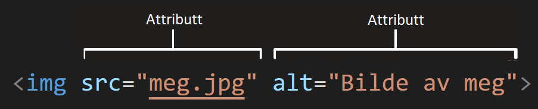

# Hva er HTML?

HTML er ikke et programmeringsspråk.
Det er et markeringsspråk, som brukes til å strukturere innhold på nettsider.
HTML består av *elementer*, som brukes for å pakke inn innhold, slik at det vises på en spesiell måte i nettleseren.
*Taggene* som pakker inn innholdet forteller nettleseren om innholdet er tekst, en lenke, et bilde, og så videre.
La oss se på eksempelet i forrige avsnitt:
```HTML
    <!DOCTYPE html>
    <html>
        <body>
            <h1>Hallo verden!</h1>
        </body>
    </html>
```

Første linje er alltid med for at nettleserene skal vite at det er en html-fil. Det som står med blå skrift er elementene som består av "tagger". *html* og *body* er viktige element vi kommer tilbake til, mens *h1* står for "header 1" og er det som gjør at Hallo verden! står som en overskrift. 

Se for eksempel på følgende linje med innhold:

```
Katten min er veldig gretten
```
Hvis vi har lyst at denne teksten skal stå for seg selv på nettsiden, kan vi legge på *paragraph*-tagger (avsnitts-tagger).

```HTML
    <!DOCTYPE html>
    <html>
        <body>
            <h1>Hallo verden!</h1>
            <p>Katten min er veldig gretten</p>
        </body>
    </html>

```

## Oppbygningen av et HTML-element

  
Delene av dette *p-elementet* er følgende:

1. **Åpningstaggen:** Denne består av navnet på elementet (i dette tilfellet p), pakket inn i *krokodillemunner*.
2. **Lukketaggen:** Denne er lik som åpningstaggen, bare at vi legger til en skråstrek før navnet på elementet.
3. **Innholdet:** I mellom taggene er innholdet i elementet, som i dette tilfellet bare er tekst.
4. **Hele elementet:** Åpningstaggen, lukketaggen og innholdet utgjør hele elementet.

Når vi skal lære oss html så vil mye av jobben bestå av å vite hva slags funksjon de ulike elementene har. 

**Lag en ny html-fil, slik som i forrige avsnitt. Skriv "html:5" og trykk tab (i stedet for enter).** 

Du vil se at VS - Code generer et skjelett for en html side slik at vi slipper å skrive det samme hver gang:

```HTML
<!DOCTYPE html>
<html lang="en">
<head>
    <meta charset="UTF-8">
    <meta name="viewport" content="width=device-width, initial-scale=1.0">
    <title>Document</title>
</head>
<body>
    
</body>
</html>
```

_Html_-elementet ligger alltid rundt hele nettsiden vår. Inne i html-elementene ligger _head_ og _body_. I head skriver vi såkalt metainformasjon, altså informasjon om nettsiden som ikke synes. I body skriver vi alt som skal synes på nettsiden vår. Disse tre elementene er med i alle nettsider. Vi har i tillegg sett på _h1_ og _p_ elementer som er til henholdsvis overskrifter og paragrafer. 

**Eksperimenter ved å sette inn noen overskrifter og paragrafer i body-elementet. Skriv for eksempel noen linjer om ferien din**

## Nøstede elementer

Du ser nå kanskje at du kan putte elementer inne i elementer, dette kalles *nøsting*.
Hvis vi har lyst til å understreke at katten vår er veldig gretten, kan vi sette "veldig" i et `<strong>` element, det vil gjøre at "veldig" blir skrevet med fet skrift på nettsiden.

```HTML
<p>Katten min er <strong>veldig</strong> gretten.</p>
```

> OBS!
>
> Her må du passe på at du nøster riktig. Dette blir feil:
>
> ```HTML
> <p>My cat is <strong>very grumpy.</p></strong>
> ```
>
> Elementene må åpnes og lukkes korrekt, slik at de er innenfor eller utenfor hverandre.
> Hvis de overlapper, slik som i koden over, vil nettleseren din prøve å tippe hva du mener, og det blir ofte feil.


## Attributter

Elementer kan også ha attributter som ser slik ut:  
  
Attributter innholder ekstra informasjon om elementet, som ikke vises på nettsiden.
I dette tilfellet er `class` attributtnavnet, og `editor-note` attributtverdien.
`class` bruker vi for å kunne hente ut dette elementet senere, slik at vi f.eks kan endre stil på det.  

Attributten skrives alltid inne i åpningstaggen til et element og må ha følgende:

1. Mellomrom mellom attributten og elementnavnet.
2. Attributtnavnet etterfulgt av et likhetstegn.
3. Attributtverdien inne i anførselstegn.

> OBS!
>
> Noen få attributter trenger ikke attributtverdi.


