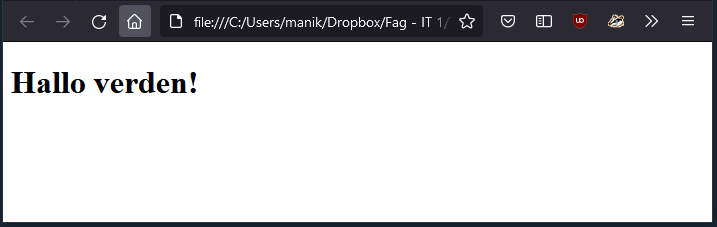

## Html lager nettsiden

Du har trolig vært på utallige nettsider hele livet uten å tenke særlig nøye gjennom hvordan de er laget. La oss få ett innblikk ved å gjøre følgende:

- Velg en nettside du ofte besøker

- Høyreklikk hvor som helst på siden.

- Velg "Undersøk" (engelsk: "Inspect") Alternativt: "Vis kildekode" ("View source code")

- Hva ser du?


 Her er nok mye uforståelig tekst, som kan virke skremmende på en fersk IT-1 elev, men det er altså slik nettsiden er laget. Nettsiden er skrevet på et eget språk som vi kaller HTML. Dette språket skrives på en spesiell form der vi kan bestemme hva som skal være på nettsiden vår, og i en begrenset grad hvordan det skal se ut. Når en nettleser leser dette tolker den det og viser nettsiden basert på hva som er skrevet.


Fra [wikipedia.org](https://no.wikipedia.org/wiki/HTML): _HyperText Markup Language (HTML, hypertekstmarkeringsspråk) er et markeringsspråk for formatering av nettsider med hypertekst og annen informasjon som kan vises i en nettleser.
HTML benyttes til å strukturere informasjon – angi noe tekst som overskrifter, avsnitt, lister og så videre – og kan, i en viss grad, brukes til å beskrive utseende og semantikk i et dokument._

Vi starter derfor kurset med å lære oss grunnleggende HTML, men det er ganske begrenset hva vi får til med en gang. For å lage virkelig gode nettsider bør man faktisk beherske minimum 3(!) språk: 

1. HTML bestemmer hva som skal være med. 
2. CSS bestemmer hvordan siden skal se ut. 
3. Javascript hjelper oss med mer avansert interaksjon på nettsiden.

Heldigvis er det ikke så vanskelig når man først har kommet igang, og vi får mye hjelp på veien. Vi starter som sagt først med lære oss å skrive html. Akkurat som når du skriver tekstfiler som word eller onenote kan lese, skal vi nå skrive en _html-fil_. Teoretisk sett kan vi skrive en slik fil i skriveprogram du allerede er vant med å bruke, men da er det ikke mye hjelp å få. Derfor vil vi ha et eget program som er laget nettopp for å blant annet å skrive HTML. Det finnes mange gode gratisalternativer for dette og det mest populære er for tiden VS Code.

Når vi har installert det vi trenger er det best å bare hoppe i det, prøv følgende:

- Åpne VS Code

- Sørg for at du har installert utvidelsen "open in browser" (les "1.2 - Oppsett" for hjelp)

- Velg File og så "New File" (Snarvei: ctrl-n / command-n)

- Velg File og så "Save as". (Snarvei: ctrl-s / command-s) 

- Navnet på fila kan for eksempel være "hjemmeside.html" (filnavnet kan være hva som helst, men det må slutte med .html)

- Kopier inn følgende tekst

```HTML
    <!DOCTYPE html>
    <html>
        <body>
            <h1>Hallo verden!</h1>
        </body>
    </html>
```

- Lagre siden igjen.

- Høyreklikk hvor som helst på siden og velg "Open in default browser". *(Dersom du ikke har dette alternativet, kan du finne fila i "Utforsker/Finder" og åpne den med en nettleser)*



Gratulerer du har nå laget din første hjemmeside. I neste kapittel ser vi nærmere på hva som skjedde.