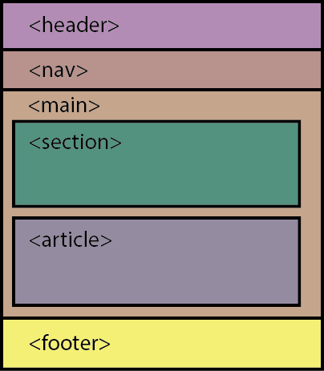

# Strukturering av nettsiden

## Block elementer vs. inline elementer

Når vi skal strukturere en nettside bør vi vite hvordan elementene våre legger seg på siden.
De fleste elementene vi bruker på nettsiden vil i utgangspunktet være enten et `block`-element eller et `inline`-element.

- Et `block`-element vil stå på en egen linje på nettsiden. Ingen elementer vil legge seg ved siden av disse. Disse elementene har ofte inline-elementer inne i seg. Eksempler på slike elementer er avsnitt (p-elementet) og lister.
- Et `inline`-element ligger inne i block-elementer, og vil ikke ligge på en egen linje. Eksempler på slike elementer er lenker og bilder.

Konsekvensen av dette er for eksempel at et bilde og en lenke vil legge seg ved siden av hverandre, mens overskrifter og avsnitt vil oppta hele plassen alener. Alle elementene legger seg i den rekkefølgen de er skrevet i html-fila. I kapittel 3 skal vi se at vi kan endre egenskapene til et element, slik at vi for eksempel kan gjøre om et inline element til å være et blokk element i stedet. Da får vi mer kontroll over hvordan nettsiden vår skal se ut.

## Semantiske elementer

For å enklere kunne strukturere nettsider bruker vi semantiske elementer, som vil si elementer med tagger som sier noe om innholdet i elementet.
Disse elementene er `block`-elementer, og de har ikke har noe eget innhold, de brukes kun til struktur.
De mest vanlige semantiske taggene er:

| Tag       | Beksrivelse |
|-----------|-------------|
|`<header>` |topptekst|
|`<main>`   |hovedinnhold|
|`<footer>` |bunntekst|
|`<section>`|samler innhold som hører sammen|
|`<article>`|selvstendig innhold|
|`
`    |diverse innhold|

En vanlig strukturering av nettsiden med semantsike elementer ser slik ut:

I nyere tid skrives ikke html nødvendigvis manuelt, og da brukes ikke de semantiske elementene så ofte, men IT-1 så kan det være veldig lurt å ha de med som en slags disposisjon for hvordan nettsiden skal se ut. Disse elementene vil også fungere som gode grupperinger når vi skal endre på utseende til nettsiden vår i kapittel 3.
