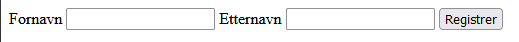

# Vanlige HTML-tagger

Vi oppsummerer html-delen av kapittelet ved å se på de vanligste elementene man bør kunne, noen av de har du allerede sett før, mens andre introduseres som nye her.

## Overskrifter - headings

```HTML
<h1>My main title</h1>
<h2>My top level heading</h2>
<h3>My subheading</h3>
<h4>My sub-subheading</h4>
```
Overskriftene går fra h1 (aller størst) til h6 (minste overskrift). Dersom vi ønsker andre typer overskrifter må vi bruke CSS.

## Avsnitt - paragraph

```HTML
<p>Dette er et avsnitt</p>
```

## Tekst - som inline element

```HTML
<span>Et element som kan brukes for ren tekst</span>
```

## Lenker

```HTML
<a href="https://www.vg.no">Mozilla Manifesto</a>
```

a-elementet står for anker. Her må vi minimum ha med en href attributt for at det skal fungere.

## Bilder

```HTML

```

img-elementet er et eksempel på et element som kun trenger en åpnings-tagg. I tillegg må src attributten være med for at bildet skal fungere. I src kan man enten refere til bildets navn på pc-en eller til en nettadresse for et bilde på internett.

## Lister

**Uordnet/punkter**

```HTML
<ul>
    <li>technologists</li>
    <li>thinkers</li>
    <li>builders</li>
</ul>
```

**Ordnet/med tall**

```HTML
<ol>
    <li>technologists</li>
    <li>thinkers</li>
    <li>builders</li>
</ol>
```

Listene består av li element som er nøstet inn i elementet som bestemmer hva slags type liste som skal være med. 


## Youtube eller Google Maps

Vi henter koden fra kilden. Se etter "Share" og så "embed". Herfra får du hele elementet for youtube/google maps, som du kan kopiere rett inn i html fila di.


## Hente innhold fra bruker


_Eksempel på form-element

`form` elementet er en ramme for element som tar for seg det å hente informasjon fra bruker, såkalte `input` element. Det å forholde seg til slik informasjon og bruke den videre er ikke noe vi får til akkurat nå, men vi ser likevel på elementene her. Dette er fordi utseende kan bygges opp kun med html, selv om det altså ikke vil ha noen funksjonalitet.

```HTML
<form action="resultat.html">
    <label for="fornavn">Fornavn</label>
    <input id="fornavn" type="text">
    <label for="etternavn">Etternavn</label>
    <input id="etternavn" type="text">
    <input type="submit" value="Registrer">
</form>
```

* label elementene er beskrivelse/tekst. De er koblet sammen til hvert sitt input element ved at for-attributten til label er lik id-attributten til input.

* input elementet kan ha mange forskjellige typer (se mer på https://www.w3schools.com/html/html_forms.asp)

* når vi trykker på knappen for å registrere sendes informasjonen til det som står i action-attributtet til form elementet.