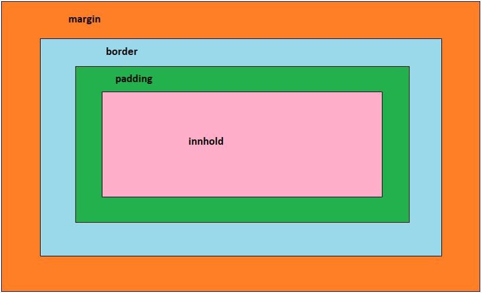
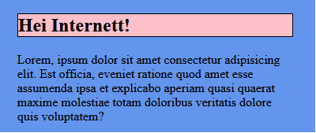
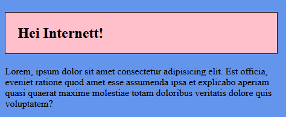

## CSS - "Boksen"



Alle html-element består av boksmodellen ovenfor, men veldig ofte er de "skrudd av" og dermed ikke synlige før vi endrer på egenskapene. La oss ta for oss et h1 element, vi setter på en bakgrunnsfarge og skrur på border i CSS.

```CSS
h1{
    background-color: pink;
    border: solid black 1px;
}
```

Da får vi følgende utseende



La oss se hvordan padding endrer på utseende:

```CSS
h1{
    background-color: pink;
    border: solid black 1px;
    padding: 20px;
}
```


Vi ser at padding fyller luft rundt innholdet til elementet, men innenfor den sorte linjen vi tegnet med border. Tilsvarende vil margin fylle luft utenfor den sorte linjen.
> OBS!
>
> Ved å sette left-, right-, top- eller bottom- foran i CSS, kan man finjustere både margin, padding og border!