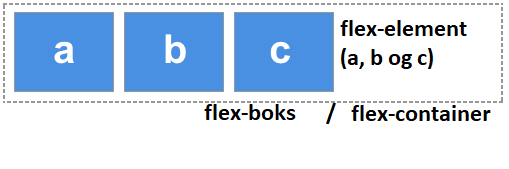
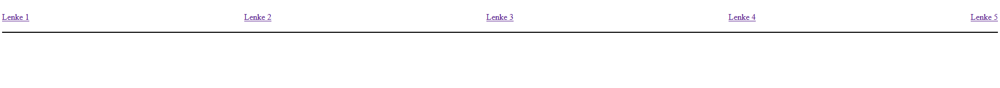
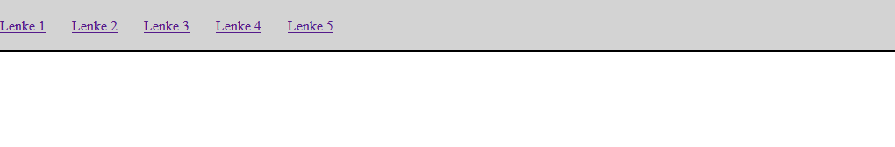
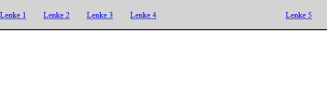

# Flex

## Plassering av elementer
Hittil har vi sett litt hvordan man kan endre stil på elementene vi ønsker, og vi har jobbet med egenskapene til "Boks-modellen".. Ettersom man har hatt et ønske om å ha bedre kontroll over hvordan elementer skal plasseres, er det utviklet flere mer avanserte teknikker som vi nå skal se nærmere på. De viktigste kalles *flex* og *grid*.

Vi bruker gjerne flex når vi jobber i en dimensjon altså på en linje eller en rad. Dette passer for eksempel perfekt til en navigasjonsbar i header-elementet. 

<bilde>

Grid bruker vi som regel til innhold i to dimensjoner, der vi lager et slags "rutenett" som vi legger elementene i.

<bilde>

## Flexboks.
Vi skal nå lage en navigasjonsbar ved hjelp av flex, denne legger vi i header. Når vi skal bruke flex må vi alltid ha et element som ligger rundt alt vi skal plassere sammen.



Siden vi lager navigasjonsbaren i header elementet, kan vi legge til et nav element som fungerer som en flex-boks:

```HTML
<body>
    <header>
        <nav class="flex-container">
            <a href="...">Lenke 1</a>
            <a href="...">Lenke 2</a>
            <a href="...">Lenke 3</a>
            <a href="...">Lenke 4</a>
            <a href="...">Lenke 5</a>
        </nav>
    </header>
</body>
```
Uten CSS ser det ut som på bildet:

I css kan vi nå "skru på" flex

```CSS
.flex-container{
    display: flex;
}
```

Legg merke til at ingenting endrer seg enda, vi må sette på egenskapene vi ønsker.

## Flex - Egenskaper.

Følgende egenskaper er mye brukt:

* flex-direction: row / column. Her bestemmer vi om flex-elementene skal plasseres langs en rad eller kolonne. Standard er rad, i så tilfelle trenger vi ikke å skrive denne egenskapen.

* justify-content: flex-start / flex-end / center / space-between /space-around. Denne egenskapen bestemmer hvordan elementene skal legge seg langs raden eller kolonnen.

* align-items: flex-start / flex-end / center /baseline. Her bestemmer vi hvordan elementene skal legge seg i "motsatt retning". Dersom vi har lagt elementene på en rad, vil align-items justere de i høyden. Motsatt vil elementer i en kolonne kunne justeres horisontalt. 

Det finnes langt flere egenskaper, men disse er de vanligste. Vi skal også bruke grid som et alternativ for en del av egenskapene vi ikke lister opp her.

> OBS!
> Vi kan altså perfekt midtstille et element ved å sette både justify-content og align-items til center.

## Navigasjonsbar - Alternativ 1

La oss jobbe videre med navigasjonsbaren vår, vi setter på litt padding og en border, samt flex-egenskaper:

```CSS
.flex-container{
    padding-top: 20px;
    padding-bottom: 20px;
    border-bottom: solid black 2px;
    display: flex;
    justify-content: space-between;
    align-items: center;
}
```

Da ser navigasjonsbaren ut som følger:


Posisjoneringen ser grei ut, vi kan nå legge CSS på selve a elementene og bruke pseudoselektoren hover for å gjøre navigasjonsbaren enda mer stilig.

## Navigasjonsbar - Alternativ 2

Vi legger nå padding på a - elementene våre og bruker flex - start:

```CSS
.flex-container{
    padding-top: 20px;
    padding-bottom: 20px;
    border-bottom: solid black 2px;
    display: flex;
    justify-content: flex-start;
    align-items: center;
}

nav a{
    padding-right: 30px;
}
```


## Navigasjonsbar - Alternativ 3 (Avansert)

Ofte er det vanlig å ha lenker til nettstedet til venstre, og logg inn eller min side til høyre. Vi grupperer lenkene slik at det bare blir to fleks-element:

```HTML
<body>
    <header>
        <nav class="flex-container">
            <div id="venstre-lenker">
                <a href="...">Lenke 1</a>
                <a href="...">Lenke 2</a>
                <a href="...">Lenke 3</a>
                <a href="...">Lenke 4</a>
            </div>
            <div id="høyre-lenker">
                <a href="...">Lenke 5</a>
            </div>
        </nav>
    </header>
</body>
```

Legg merke til at "barna" til flexboksen nå kun er de to div-elementene. Vi kan sette space-between på disse. Vi kan definere div-elementene som **egne** flexbokser og justere a elemente de inneholder!

```CSS
        .flex-container{
            background-color: lightgray;
            padding-top: 20px;
            padding-bottom: 20px;
            border-bottom: solid black 2px;
            display: flex;
            justify-content: space-between;
            align-items: center;
        }  
        nav div a{
            padding-right: 30px;
        }
```

