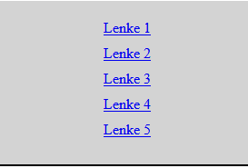

# Flex

## Plassering av elementer

Hittil har vi sett litt hvordan man kan endre stil på elementene vi ønsker, og vi har jobbet med egenskapene til "Boks-modellen". Ettersom man har hatt et ønske om å ha bedre kontroll over hvordan elementer skal plasseres, er det utviklet flere mer avanserte teknikker som vi nå skal se nærmere på. Den første av disse kalles `flex`.

Vi bruker gjerne flex når vi jobber i en dimensjon altså på en linje eller en rad. Dette passer fint til en navigasjonsbar for et nettsted som består av flere sider. Da vil vi gjerne ha en oversiktlig rad med lenker på toppen av nettsidene våre. 


## Flexboks.

Når vi skal bruke flex må vi alltid ha et element som forelder for alle elementene vi skal posisjonere.


La oss bruke flex til å lage en navigasjonsbar. Denne bør ligge i header-elementet. For oversiktens del kan vi så nøste inn et nav element som kan være forelder til alle lenkene våre:

```HTML
<body>
    <header>
        <nav>
            <a href="...">Lenke 1</a>
            <a href="...">Lenke 2</a>
            <a href="...">Lenke 3</a>
            <a href="...">Lenke 4</a>
            <a href="...">Lenke 5</a>
        </nav>
    </header>
</body>
```
Uten CSS ser det ikke spesielt imponerende ut:


I css kan vi nå "skru på" flex

```CSS
nav{
    display: flex;
}
```

Legg merke til at ingenting endrer seg enda, vi må sette på egenskapene vi ønsker.

## Flex - Egenskaper.

Følgende egenskaper er mye brukt:

* `flex-direction`: row / column. Her bestemmer vi om flex-elementene skal plasseres langs en rad eller kolonne. Standardinnstillingen er rad altså horisontlt, i så tilfelle trenger vi ikke å ha med denne egenskapen.

* `justify-content:` flex-start / flex-end / center / space-between /space-around. Denne egenskapen bestemmer hvordan elementene skal legge seg langs raden eller kolonnen.

* `align-items:` flex-start / flex-end / center /baseline. Her bestemmer vi hvordan elementene skal legge seg i "motsatt retning". Dersom vi har lagt elementene på en rad, vil align-items justere de i høyden. Motsatt vil elementer i en kolonne kunne justeres horisontalt. 

Det finnes flere egenskaper, men dette er de viktigste for oss.

> OBS!
> Vi kan altså perfekt midtstille et element ved å sette både justify-content og align-items til center.

## Navigasjonsbar - Alternativ 1

La oss jobbe videre med navigasjonsbaren vår, vi setter på litt padding og en border, samt flex-egenskaper:

```CSS
.nav{
    padding-top: 20px;
    padding-bottom: 20px;
    border-bottom: solid black 2px;
    display: flex;
    justify-content: space-between;
    align-items: center;
}
```

Da ser navigasjonsbaren ut som følger:


Vi ser at "space-between" verdien gjør at barna til nav fyller hele skjermen, men like mye luft i mellom

## Navigasjonsbar - Alternativ 2

Vi legger nå padding på a - elementene våre og bruker flex - start:

```CSS
nav{
    padding-top: 20px;
    padding-bottom: 20px;
    border-bottom: solid black 2px;
    display: flex;
    justify-content: flex-start;
    align-items: center;
}

nav a{
    padding-right: 30px;
}
```


## Navigasjonsbar på mobil - Alternativ 3

For en nettside til mobiltelefon, er det beste som regel å ha fleks-elementene i en kolonne. Vi endrer flex-direction og setter litt padding mellom lenkene:

```CSS
        nav{
            background-color: lightgray;
            padding-top: 20px;
            padding-bottom: 20px;
            border-bottom: solid black 2px;
            display: flex;
            flex-direction: column;
            align-items: center;
        }  
        nav a{
            padding-bottom: 10px;
        }
```


## Navigasjonsbar - Alternativ 4 

Ofte er det vanlig å ha lenker til nettstedet til venstre, og logg inn eller min side til høyre. Vi grupperer lenkene slik at det bare blir to fleks-element:

```HTML
<body>
    <header>
        <nav class="flex-container">
            <div id="venstre-lenker">
                <a href="...">Lenke 1</a>
                <a href="...">Lenke 2</a>
                <a href="...">Lenke 3</a>
                <a href="...">Lenke 4</a>
            </div>
            <div id="høyre-lenker">
                <a href="...">Lenke 5</a>
            </div>
        </nav>
    </header>
</body>
```

Legg merke til at "barna" til flexboksen nå kun er de to div-elementene. Vi kan sette space-between på disse. Dersom vi ønsker kan vi definere div-elementene som **egne** flexbokser og justere a elemente de inneholder!

```CSS
        .flex-container{
            background-color: lightgray;
            padding-top: 20px;
            padding-bottom: 20px;
            border-bottom: solid black 2px;
            display: flex;
            justify-content: space-between;
            align-items: center;
        }  
        nav div a{
            padding-right: 30px;
        }
```


