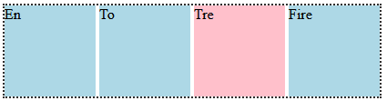
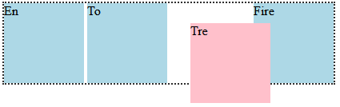
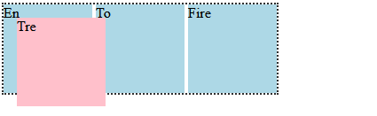

# Float og Position

Før grid og flex var en del av hverdagen for CSS var det langt mer kronglete å få plassert elementer slik vi ville ha de på nettsiden vår. I starten fantes ikke CSS i det hele tatt og da brukte man stort sett bare usynlige tabeller som man fylte med innhold. Så dukket CSS opp, men fortsatt med relativt begrensede muligheter for plassering. Da brukte man veldig ofte egenskapene **float** og **position**.

Etterhvert som flex og til slutt grid ble introdusert, er float og position mindre viktige, men de har fortsatt noen fine bruksområdet som vi kan se nærmere på. 


## Float

kommer

## Position

Position er en css-egenskap der man presist bestemmer hvor et element skal ligge. Egenskapen kan ha en av flere verdier, og vi skal gå igjennom de viktigste her. Disse er **position: static;**  **position: relative;** **positive: absolute;**  og **position: fixed;**.

### position: static

Alle elementene er i utgangspunktet satt til å være statiske. Det betyr at de følger de vanlige plasserings-reglene slik vi er vant til. Block-elementer legger seg under hverandre og inline-elementer legger seg ved siden av hverandre. Det er derfor som regel ingen grunn til å sette noen elementer til static, men det er greit å vite at verdien finnes.

### Eksempel

For å få en god forståelse av hvordan de andre verdiene fungerer lager vi først kode for noen "bokser"

```HTML
    <div class="forelder">
        <div class="boks" id="en">En</div>
        <div class="boks" id="to">To</div>
        <div class="boks" id="tre">Tre</div>
        <div class="boks" id="fire">Fire</div>
    </div>
```

Med påfølgende CSS

```CSS
    .forelder{
        border: dotted black 2px;
        display: inline-block;
    }

    .boks{
        display: inline-block;
        background: lightblue;
        width: 100px;
        height: 100px;
    }

    #tre{
        background: pink;
    }
```

> Legg merke til at inline-block (i motsetning til bare inline), lar oss sette høyde og bredde på elementene. Alternativt kunne vi brukt flex, men eksempelet er best når elementene ikke er dynamiske.



### position: relative

En relativ posisjon lar oss flytte på plasseringen på et element basert på der det allerede ligger. Hvis vi setter relativ posisjon følger det de vanlige reglene (statisk), men vi kan nå "dytte" elementet i alle retninger:

```CSS
    #tre{
        bacground: pink;
        position: relative;
        left: 25px;
        top: 25px;
    }
```
Vi "dytter" altså elementet 25 piksler nedover (fra toppen), og 25 piksler mot høyre (fra venstre). Da ser det ut som følger:



### position: absolute 

Legg merke til at den relative posisjonen av boksen etterlater et tomrom der den opprinnelig var. Med absolutt posisjonering blir det motsatt. Da fjernes boksen fra sin opprinnelige posisjon og legger seg der hvor forelderen starter. Vi kan så dytte den på samme måte og får følgende effekt:

```CSS
    #tre{
        bacground: pink;
        position: relative;
        left: 25px;
        top: 25px;
    }
```



> NB! Følgende er et veldig nyttig triks! Problemet med absolutt posisjonering er at elementet ikke flytter seg når vi endrer på størrelsen av skjermen (noe vi ofte ønsker). Det løser vi ved å sette forelderen til relativ og så barna til absolutte. Da vil barnas posisjon være absolutt men endre seg sammen med det realtive forelder elementet. Dette virker kanskje forvirrende men er ganske enkelt å få til i praksis, se neste eksempel.

### Eksempel: Drop-down meny

La oss bruke det vi har sett på av relativ og absolutt posisjonering for å lage en drop down meny. Vi ser av tipset ovenfor at vi må ha et **relativt forelder element** og **absolutte barn**. Drop down menyen vår skal bestå av en synlig lenke og tre skjulte lenker som skal dukke opp når vi holder musepekeren over den synlige lenken:

```HTML
    <div class="dropdown">
        <a href="#">Klær</a>
        <div class="usynlig">
            <a href="#">Jakker</a>
            <a href="#">Kjoler</a>
            <a href="#">Topper</a>
        </div>
    </div>
```

La oss nå legge på CSS. Dropdown-klassen skal være relativ og usynlig-klassen skal være absolutt. Da vil barna automatisk legge seg under "Klær". Siden a elementene skal legge seg under hverandre setter vi disse til block-elementer. Vi gjør lenkene usynlige ved å sette **display: none;** på disse. Legg merke til den siste selektoren, når vi holder musepekeren over det relative elementet så skal de usynlige elementene dukke opp ved at vi endrer disse til **display: block;**

```CSS
        .dropdown{
            position: relative;
        }
        .usynlig{
            position: absolute;
            display: none;
        }
        .usynlig a{
            display: block;
        }
        .dropdown:hover .usynlig{
            display: block;
        }
```

Prøv selv med å skrive koden du ser over. Prøv så å lage en ordentlig navigasjonsbar med drop-down meny (Farger, bakgrunn, padding etc). Legg merke til at det finnes mange alternative måter å lage langt mer spenstige drop-down menyer på, men det venter vi med for nå.

### position fixed

Med denne verdien låser vi et element på plass uansett hvordan vi scroller på siden. Tenk deg for eksempel en navbar som alltid er med på toppen av siden uansett hvor langt ned du har kommet. Da må du sette header elementet til fixed, men i tillegg må vi sørge for at headeren alltid kommer over resten av nettsiden. Det gjør vi ved å øke z-indeksen. Prøv selv med en navigasjonsbar du har laget, legg til følgende inn i CSS koden din:

```CSS
header{
    position: fixed;
    z-index: 2;
}
```