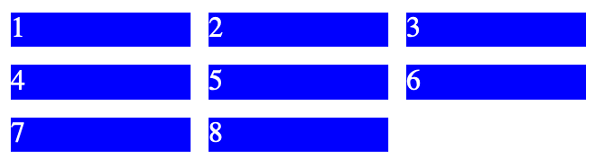

# Grid

For å plassere innhold på nettsiden i to dimensjoner, bruker vi grid.
En grid fungerer som et slags rutenett, hvor vi kan bestemme hvordan elementer skal legge seg.

Eksemplet under viser hvordan vi kan lage en enkel grid.

## HTML

På samme måte som med flex må vi alltid ha et element som ligger rundt alt vi skal plassere sammen i en grid.
I koden under har vi et section-element med klassen mini-grid, rundt elementene som skal plasseres ut på nettsiden.

```HTML
<section class="mini-grid">
    <div class="boks">1</div>
    <div class="boks">2</div>
    <div class="boks">3</div>
    <div class="boks">4</div>
    <div class="boks">5</div>
    <div class="boks">6</div>
    <div class="boks">7</div>
    <div class="boks">8</div>
</section>
```

## CSS

Vi henter ut klassen .mini-grid, og setter `display: grid;` på den for å gjøre den om til en grid.

Deretter må vi definere hvordan gridden skal se ut, det gjøres med egensakepen `grid-template-columns`, verdien av denne forteller hvordan gridden ser ut.
`grid-template-columns: 1fr 1fr 1fr` gir en grid med tre like store elementer i bredden.
`1fr` står for 1 *fraction*, altså 1 del.
Hadde vi skrevet fire 1fr etter hverandre, hadde vi fått fire like store elementer i bredden.

`grid-gap: 10px` lager 10px med "luft" (margin) mellom alle elementene i gridden.

```CSS
.mini-grid{
  display: grid;
  grid-template-columns: 1fr 1fr 1fr;
  grid-gap: 10px;
}
.boks{
    background-color: blue;
    color: white;
}
```

> Skal man ha mange elementer i bredden, kan man bruke repeat.
> Eks: `repeat(4,1fr)`, som tilsvarer `1fr 1fr 1fr 1fr`

## Nettside

Resultatet av koden over blir slik:


