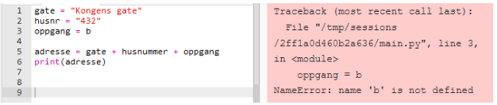

# Oppgaver med løsning

## Variabler og Datatyper

#### Oppgave 1.1

Print ut noen selvvalgte beskjeder. Prøv å se hva som skjer dersom du glemmer anførselstegnene.

 

#### Oppgave 1.2 

a ) Hva tror du skjer dersom vi kjører følgende kode? 

```PYTHON
a = 2
print(a + 2)
``` 

b) Hvorfor er det ingen anførselstegn i print-instruksjonen denne gangen?

<details>
    <summary>Klikk for Løsning</summary>

    Koden printer ut 4. Vi kan ikke bruke anførselstegn fordi det ikke er en streng vi skal printe ut

</details>


#### Oppgave 1.3

Se på følgende kode:

```PYTHON
lengde = 5
bredde = 7

areal = lengde*bredde

print("Arealet av rektangelet er", areal)
```
Hvorfor bruker vi variable for lengde og bredde? Kunne vi ikke bare ha skrevet arealet rett inn i print-funksjonen?

<details>
    <summary>Klikk for Løsning</summary>

    Variable gir bedre oversikt når man leser koden. Dersom man ønsker å regne areal for et annet rektangel er det mye lettere å endre på verdien på variablene enn å gå inn i resten av koden for å endre på tallene. Dette blir spesielt viktig jo større koden er.

</details>


#### Oppgave 1.4

Spør den du sitter nærmest om alder. Lagre både navn og alder i to forskjellige variabler. Print en tekst som skriver ut følgende tekst rikig: Hei *navn*, du er *alder* år.

<details>
    <summary>Klikk for Hint</summary>

    Lag et input-felt for navn og alder. Husk komma i mellom strenger og variable når du printer ut
</details>

<details>
    <summary>Klikk for Løsning</summary>

    navn = input("Hva heter du? ")
    alder = input("Hvor gammel er du? ")

    print("Hei", navn, "du er", alder, "år")

</details>


#### Oppgave 1.5



a) Forklar hva som er galt med denne koden? Hvorfor blir det feil? Rett opp koden slik at den kjører 

b) Skriv adressen ut på følgende to måter ved å bruke variabler: "Adressen er Kongens gate 432b" og "Gaten er Kongens Gate, husnummeret er 432, oppgang b" 

<details>
    <summary>Klikk for Løsning</summary>

    a) I linje 3 er b skrevet uten anførselstegn. Da leter programmet etter en variabel som heter b, somn ikke finnes.

    b) 
    
    gate = "Kongens gate"
    husnr = "432"
    oppgang = "b"

    print("Adressen er", gate + husnummer + oppgang)
    print("Gaten er", gate, ", husnummeret er", husnr, "oppgang", oppgang)

</details>


#### Oppgave 1.6

Du er på restaurant med venner, og på regningen er følgende informasjon:

Total pris for mat og drikke: 850 kr
Ungdomsrabatt: 25 % 
Tips: 10 %

a) Legg informasjonen inn i variabler som tall (ikke bruk %, det gir ikke mening når vi programmerer)

b) Bruk variablene for total pris og ungdomsrabatt til å regne ut rabatten.

c) Trekk fra rabatt og bruk så variabelen for tips til å regne ut tips. 

d) Legg på tips, og skriv ut summen for måltidet etter både rabatt og tips 

e) Lag en variabel for antall personer, og skriv ut pris per person samt antall personer.

<details>
    <summary>Klikk for Hint</summary>
    - Lag de tre variablene

    - Husk prosentformlene: pris*rabatt/100 gir selve rabatten

    - Lag egne variable for alle mellomregningen.

    - Bruk mellomregningene til å regne ut det som skal betales

    - print ut alle variable du er usikre på underveis så er det lettere å finne ut om matematikken stemmer

</details>
<details>
    <summary>Klikk for Løsning</summary>

    # Her regner vi tips før rabatt, man kan argumentere for at det kan gjøres motsatt

    pris = 850
    rabatt_prosent = 25
    tips = 10
    ant_pers = 3

    rabatt_kr = pris*rabatt_prosent/100
    tips_kr = pris*tips_kr

    totalt = pris - rabatt_kr + tips_kr/100
    per_pers = totalt/ant_pers

    print("Pris etter rabatt og tips er", totalt, "det blir", per_pers, "kr per person")

</details>


#### Oppgave 1.7

Formelen for å regne Fahrenheit om til Celsius er C = (F-32)*5/9. Lag et program som spør brukeren om temperaturen i fahrenheit. Regn om til Celsius og skriv en beskjed som sier hvor mange grader Celsius det tilsvarer. 

<details>
    <summary>Klikk for Hint</summary>
   
    Lag en input som tar inn temperatur, husk å gjøre om til desimaltall

    Regn ut Celsius med formelen, lagre i en ny variabel

    Skriv ut variabelen sammen med input variabelen i en passende tekst

</details>
<details>
    <summary>Klikk for Løsning</summary>
    
    f_heit = float(input("Hvor mange Fahrenheit? "))
    celsius = (f_heit-32)*5/9

    print(f_heit, "Fahrenheit tilsvarer, celsius, "grader Celsius")

</details>


#### Oppgave 1.8

Endre på koden i oppgave 6 slik at alle variablene skrives inn som input, det vil si at vi selv kan velge totalpris, rabatt, tips og antall personer 

<details>
    <summary>Klikk for Løsning</summary>
    
    pris = float(input("Hva kostet måltidet? "))
    rabatt_prosent = float(input("Har du eventuell rabatt? "))
    tips = float(input("Vil du gi tips (oppgi i prosent) "))
    ant_pers = float(input("Hvor mange er dere? "))

    rabatt_kr = pris*rabatt_prosent/100
    tips_kr = pris*tips_kr

    totalt = pris - rabatt_kr + tips_kr/100
    per_pers = totalt/ant_pers

    print("Pris etter rabatt og tips er", totalt, "det blir", per_pers, "kr per person")

</details>

## Betingelser

#### Oppgave 2.1 

Lag en variabel med et tall mellom 1 og 10. Spør så brukeren om å gjette et tallet. Dersom det er riktig gjettet, skriver du ut "Gratulerer! Du gjettet riktig". Ved feil skriver du "Beklager, du gjettet feil". Ta vare på koden, du skal bruke den senere. 

<details>
    <summary>Klikk for Hint</summary>
   
    Bruk en betingelse. Husk == for å sjekke likhet når du lager en betingelse

</details>
<details>
    <summary>Klikk for Løsning</summary>
    
    riktig = 4
    gjett = int(input("Gjett et tall mellom 1 og 10"))

    if gjett == riktig:
        print("Du klarte det")
    else:
        print("Beklager, prøv igjen")

</details>

## Betingelser

#### Oppgave 2.1

Med variablene a = 3, b = 7 og c = "7", d = 3.  
Hvilket utfall gir testene nedenfor? (True, False eller noe annet?)  
a)	`a < b`  
b)	`a > b`    
c)	`b >= c`  
d)  `a = c`  
e)  `a == d`  
f)  `a > d or a == d`  
g)  `a > d and a == d`  


<details>
    <summary>Klikk for Løsning</summary>
    Løsning

    a) True  
    b) False  
    c) Feilmelding  
    d) Det er ikke en test, verdien av a settes til "7"
    e) True
    f) True
    g) False

</details>

#### Oppgave 2.2

Bytt ut `# din kode her` slik at `Morna Erna` skrives ut

````python
statsminister = "Jonas Gahr Støre"

if # din kode her
    print("Morna Erna")
else:
    print("Morna Jonas")

````

<details>
    <summary>Klikk for Hint</summary>
    Hint
    
    a == b betyr at a er lik b

</details>
<details>
    <summary>Klikk for Løsning</summary>
    
    Løsning

    statsminister = "Jonas Gahr Støre"

    if statsminister == "Jonas Gahr Støre":
        print("Morna Erna")
    else:
        print("Morna Jonas")


</details>

#### Oppgave 2.3

Slottet har installert et nytt alarmsystem, som kun slipper folk som heter `Kong Harald` inn dørene. Lag et program som sjekker om en bruker heter `Kong Harald`, og sier velkommen hvis det stemmer, ellers skal programmet si `Ha deg vekk!`.

<details>
    <summary>Klikk for Hint</summary>
    
    Du kan starte med denne koden:
    
    print("Velkommen til slottet")
    print("Hva heter du?")
    navn = input("Navn: ")

    # Her skal du sjekke om navn er lik `Kong Harald`

</details>
<details>
    <summary>Klikk for Løsning</summary>
    Løsning

    navn = input("Navn: ")
    if navn == "Kong Harald":
        print("Velkommen!")
    else:
        print("Ha deg vekk!")

</details>

#### Oppgave 2.4 

a) Lag et program der man kan skrive inn poengsummen for en matematikkeksamen. Programmet skal skrive ut karakteren på eksamen når vi bruker følgende skala (maks 60 poeng): 

| Karakter | 1 | 2 | 3 | 4 | 5 | 6 |
|-|-|-|-|-|-|-|
| Poeng | | 12 | 24 | 35 | 45 | 56 |

b) Endre koden slik at programmet "Ugyldig poengsum" dersom man ikke skriver inn et tall mellom 0 og 60

<details>
    <summary>Klikk for Hint</summary>
   
    Her må du ha flere betingelser i samme setning, husk at du kan legge til elif-betingelser etter if- setningen for at de er koblet sammen.

    Du må også sjekke både øvre og nedre grense for et tall, da fungerer nøkkelordet "and" bra.

</details>
<details>
    <summary>Klikk for Løsning</summary>
    
    poeng = int(input("Hvor mye poeng fikk du? "))

    if poeng >= 0 and poeng < 11:
        print("Beklager du fikk 1 - Ikke bestått")
    elif poeng >= 12 and poeng < 24:
        print("Du fikk karakter 2")
    elif poeng >= 35 and poeng < 45:
        print("Du fikk karakter 3")
    elif poeng >= 35 and poeng < 45:
        print("Du fikk karakter 4")
    elif poeng >= 45 and poeng < 56:
        print("Du fikk karakter 5")
    elif poeng >= 56 and poeng < 60:
        print("Du fikk karakter 6")
    else:
        print("Du har skrevet inn en ugyldig poengsum"
        )
</details>


#### Oppgave 2.5 

#### Oppgave 2.3

Lag en tekstbasert versjon der du kan spille "Stein - Saks -  Papir" mot datamaskinen.

Programmet kan skrive ut følgende:

"Velg 1 for Stein, 2 for Saks eller 3 for Papir", så sjekker du valget opp mot datamaskinens valg

Her kan du ha behov for å trekke tilfeldige heltall, og da må vi importere en instruks utenifra.

Start koden med 

```PYTHON
from random import *

# Nå vil instruksen randint(start, slutt) trekke et tilfeldig heltall i området du spesifiserer
```

<details>
    <summary>Klikk for Hint</summary>
   
    Ta imot et tall mellom 1 og 3 fra bruker
    Trekk et tall mellom 1 og 3 for datamaskinen

    Sammenlign tallene med en betingelse der du sjekker valgene opp mot hverandre og skriv ut resultatet. 
    
    For eksempel hvis bruker skriver 1 (Stein) og datamaskinen velger 2 (Saks) så skriver du ut "Du vant, motstanderen valgte saks!"

</details>
<details>
    <summary>Klikk for Løsning</summary>
    
    from random import *

    spiller_valg = int(input("Velg 1 for Stein, 2 for Saks eller 3 for Papir: "))

    data_valg = randint(1,3)

    if spiller_valg == data_valg:
        print("Uavgjort!")
    elif spiller_valg == 1 and data_valg == 2:
        print("Du vant, mostanderen valgte saks!")
    elif spiller_valg == 1 and data_valg == 3:
        print("Du tapte, mostanderen valgte papir!")
    elif spiller_valg == 2 and data_valg == 1:
        print("Du tapte, mostanderen valgte stein!")
    elif spiller_valg == 2 and data_valg == 3:
        print("Du vant, mostanderen valgte papir!")  
    elif spiller_valg == 3 and data_valg == 1:
        print("Du vant, mostanderen valgte stein!")
    elif spiller_valg == 3 and data_valg == 2:
        print("Du tapte, mostanderen valgte saks!") 
    else:
        print("Du har valgt feil!")
        
</details>


## Løkker

#### Oppgave 3.1

a) Bruk en while-løkke til å printe ut alle tallene fra 0 til og med 100

b) Bruk en for-løkke til å printe ut alle tallene fra 0 til og med 100

c) Bruk en for-løkke til å printe ut alle partallene fra og med 400 til og med 600

<details>
    <summary>Klikk for Løsning</summary>

a) 

tall = 0
while tall < 101:
    print(tall)
    tall = tall + 1 # Kan alternativt skrive tall += 1

b)

for tall in range(101):
    print(tall)

c) 

for tall in range(400, 601,2):
    print(tall)


</details>

#### Oppgave 2.6

I fornøyelsesparken Titusenfryd må man være minst 100 cm høy for å kjøre berg-og-dal-banen Thundercoaster. Skriv et program med en if-setning som tester om en person er høy nok.

<details>
    <summary>Klikk for Løsning</summary>
    Løsning

    høyde = int(input("Hvor høy er du? (cm): "))

    if høyde >= 100:
        print("Gratulerer, du kan kjøre Thundercoaster")

</details>

#### Oppgave 2.7

Hos friske mennesker varierer kroppstemperaturen vanligvis mellom 36.5 og 37.5 grader. Lag et program som avgjør om en persons kroppstemperatur ligger henholdsvis under, innenfor eller over normal kroppstemperatur. Programmet skal skrive ut passende beskjed.

<details>
    <summary>Klikk for Løsning</summary>
    Løsning

    temp = int(input("Temperatur (celsius): "))

    if temp > 37.5:
        print("Du har høyere kroppstemperatur enn vanlig")
    elif temp < 36.5:
        print("Du har lavere kroppstemperatur enn vanlig")
    else:
        print("Du har helt normal kroppstemperatur")
</details>

#### Oppgave 2.8


| Karakter | 1   | 2   | 3   | 4   | 5   | 6   |
| -------- | --- | --- | --- | --- | --- | --- |
| Poeng    |     | 12  | 24  | 35  | 45  | 56  |

a) Forklar hva følgende kode gjør:

```PYTHON
sum = 0 
n = 200

for tall in range(1,n+1):
    sum = sum + tall

print(sum)
```
b) Lag et program som regner ut summen av de n første oddetallene. La bruker bestemme n.

<details>
    <summary>Klikk for Løsning</summary>

    a) tall er løkkas variabel, og vil starte på 1 og slutte når den er n (som her er 200). 
    
    Den øker med 1 hver gang løkka kjøres. 

    sum øker med tall for hver gang, altså regner vi summen av de 200 første tallene

    b)


</details>


#### Oppgave 3.3

Ta frem koden koden for Stein - Saks - Papir. Legg på funksjonalitet slik at programmet spør om man vil spille en gang til etter et spill. Hvis "ja" så spiller man om igjen, ellers stopper programmet.

<details>
    <summary>Klikk for Hint</summary>
   
    Hint:

    Lag en variabel som du setter til "ja"
    
    Legg en while-løkke rundt programmet som sjekker om variabelen er "ja".

    På slutten av spillet (i løkka), oppdaterer du variabelen med en input der du spør om det skal spilles om igjen


</details>
<details>
    <summary>Klikk for Løsning</summary>
    
    kommer

</details>


#### Oppgave 2.9

Gitt at verdien av b = False, og verdien av x = 0. Hva er sannhetsverdien (True eller False) til følgende uttrykk? 
1.  `b`
2.	`x == 0`
3.	`b and x == 0`
4.	`b or x == 0`
5.	`not b and x == 0`
6.	`not b or x == 0`
7.	`b and x != 0`
8.	`b or x != 0`
9.	`not b and x != 0`
10.	`not b or x != 0`


<details>
    <summary>Klikk for Hint</summary>
    Hint

    x == y : gir True hvis x og y er like, ellers False
    x != y : gir True hvis x og y IKKE er like, ellers False
    x and y: gir True hvis både x og y er True
    x or y : gir True hvis en av x og y er True
    not x  : gir True hvis x er False
    

</details>
<details>
    <summary>Klikk for Løsning</summary>
    Løsning

    1. False
    2. True
    3. False (Hver side av "and" må være True, her er høyresiden True (x == 0), mens venstresiden (x) er False)
    4. True (Bare en side av "or" må være True, her er høyresiden True (x == 0), mens venstresiden (x) er False)
    5. True
    6. True
    7. False
    8. False
    9. False
    10. True

</details>

#### Oppgave 2.10

**SJAMAN-PROGRAMMET**

Lag et program som skriver ut tekster med personlige spådomer. Hvilken tekst som skal skrives ut avhenger av verdiene i variablene: kjønn, fødselsår og navn.  
Et eksempel på en spådom kan være:  
`Kjære Trine Skei Grande, denne måneden vil du motta en gave fra en ukjent. Unngå pengespill og gatekjøkkenmat. Dette gjelder spesielt deg som er dame og født i 1969.`

#### Oppgave 2.11

**SKUDDÅR**

Lag et program som avgjør om et årstall er skuddår eller ikke.  
> Tips: for å sjekke om tall er delelig på 4, bruk modulo. Eks: tall % 4 == 0 gir true hvis tallet er delelig på 4.

1. Bruk reglene som gjaldt fra 8 e.kr til 1582:
   - Et år er et skuddår hvis årstallet er delelig på 4.

2. Endre programmet fra `1.` slik at du bruker reglene som er litt mer korrekt enn `1.`:
   - Et år er et skuddår hvis: 
     - årstallet er delelig på 4, eks: 2012 var skuddår, men ikke 2014
     - men ikke hvis årstallet er delelig på 100, eks: 1900 var ikke skuddår
     - men likevel hvis det er også er delelig på 400, eks: 2000 var skuddår

3. Lag et skuddårsprogram med komplette regler:
   - Regler for skuddår:
     -  før 46 f.kr: Ingen skuddår
     -  45 f.kr – 9 f.kr: Skuddår hvis delelig på 3
     -  8 f.kr – 7 e.kr: Ingen skuddår (pause)
     -  8 e.kr – 1581: Skuddår hvis delelig på 4
     -  fra 1582: delelig på 4, men ikke på 100, unntatt delelig på 400
