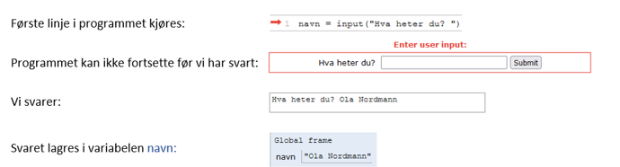
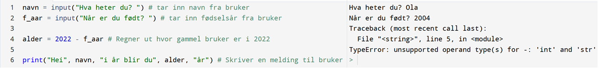
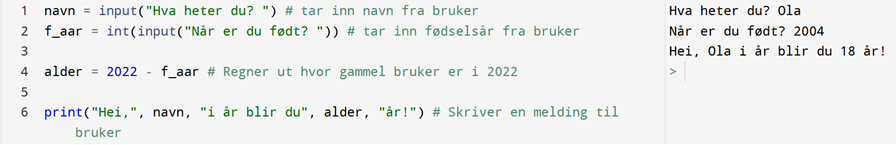

# Variabler


*På samme måte som med krydderhylla, kan vi lagre mye forskjellig i datamaskinens minne*


En av de viktigste prinsippene når vi skal kode, er at vi kan lagre alt mulig i datamaskinens minne. Det vi lagrer kan vi hente opp igjen i koden, og bruke når vi selv ønsker det. Når vi lagrer noe i datamaskinens minne på denne måten kaller vi det for en `variabel`. God bruk av variable er fundamentalt for å lære seg å programmere godt. Akkurat som med glassene i bildet over, kan vi lagre alt mulig rart; bokstaver, setninger, tall og lister er eksempler på variable som ofte brukes. Der det er lurt å merke glassene, må vi i den digitale verden også være påpasselige å si nøyaktig hva vi lagrer, slik at datamaskinen har riktig oversikt. Da vil vi samtidig også være i stand til å hente frem riktig variabel når vi trenger den. 

## Lagre en variabel.
Dersom vi for eksempel ønsker å lagre tallet 10 skriver vi 

```PYTHON
tall = 10
```

 Navnet på variabelen (i dette tilfellet `tall`) tilsvarer merkelappen til krydderhylla. Selv om vi bestemmer navnet selv, bør vi velge et navn som gir mening. Vi skal se nærmere for skikk og bruk for variabelnavn etterhvert. Som nevnt kan vi lagre langt mer enn bare tall, men vi må samtidig være spesifikke på hva vi lagrer. Vi deler variablene våre inn i forskjellige `datatyper`, som alle har forskjellige skrivemåter


## Hente en variabel

Når vi har lagret en variabel kan vi hente den ved å bruke navnet (merkelappen) vi satte på den:

```PYTHON
tall = 10
print(tall)
```
Hva tror du skrives til konsollen? Sjekk selv.


## Datatyper

| Navn | Skrivemåte | Datatype |
|----------|------------|-----------|
| streng | x = "skriv tekst og tall"  | str |
| heltall  | x = 10        | int |
| desimaltall| x = 10.0    | float |
| boolsk | x = True / x = False | bool |
| liste | x = [1,2,"eple"] | list |
| ordbok| x = {eple: 2, banan: 3} | dict |

*Her ser du en tabell med de ulike datatypene vi skal gjennom. Det finnes flere, for eksempel objekter, som er så avanserte at vi venter med de til It-2.*


#### Strenger (eng: String)

Med strenger tenker vi som regel på all tekst men en streng er i bunn og grunn en kombinasjon av bokstaver, symboler og tall vi kan skrive med tastaturet. En streng må skrives med anførselstegn rundt, da vil det som står inne ikke kunne forveksles med andre datatyper eller variabelnavn. Dermed har vi litt bedre forståelse av instruksjonen fra forrige kapittel:

```PYTHON
print("Hei alle sammen!")
```

Setningen vi ville skrive ut er en streng, og må dermed være i anførselstegn. Dersom vi ikke har de med vil datamaskinen lete etter en variabel som heter Hei. Siden den ikke finnes, får vi en feilmelding.


#### Tall

Når vi jobber med tall holder det å skrive tallet (vi bruker ikke anførselstegn). Python har også de fire regneartene innebygd,  

```PYTHON
tall1 = 10
tall2 = 4.2
print(tall1 + tall2)
```

*Hva printes ut her?*

Fra tidligere vet du at man relativt greit kan regne om heltall til totallsystemet og omvendt. For desimaltall blir konverteringen til bytes vanskeligere (og utenfor pensum). Vi har likevel fått det til, og dermed har vi to forskjellige datatyper for tall. Disse kalles `heltall` og `flyt-tall`. I praksis er det ikke så mye forskjell for vår del, men det kan dukke opp feil der man for eksempel prøver å behandle et heltall som om det var et desimaltall. I matematikken ville det vært uproblematisk, men når vi koder må vi være klar over forskjellen.

#### Boolske variable

```PYTHON
test = True
```

En slik variabel kan kun ha verdiene True eller False. Tenk på den som en bryter som kun kan være av eller på. Vi bruker de ikke så ofte, men de er en del av betingelser som vi skal se på senere.

#### Lister og Ordbøker

```PYTHON
liste = ["eple", "banan", "appelsin"]
```

Dette er mer avanserte datatyper som vi skal se på i egne kapittel. Vi kan for eksempel samle data, tall og/eller egenskaper, og har mange verktøy vi kan utføre på disse for rask analyse.

#### Input

Dette er egentlig en streng, men den har en spesiell form og brukes masse for å lage interaksjon med brukeren av programmet (før vi gjør det med grafikk)

```PYTHON
navn = input("Hva heter du? ")
```

Når vi kjører programmet vil du se at spørsmålet stilles i konsollen. Programmet fortsetter ikke før vi har svart på spørsmålet. Svaret vårt lagres som en streng i variabelen navn:




## Konvertere datatyper 

Se på følgende kode:



Her får vi en feilmelding som går på datatyper. Du husker kanskje at alle input-variable lagres som strenger? Når vi skal regne ut alderen så prøver vi å blande tallet 2022, med strengen som er lagret i f_aar. Det går ikke an å regne matematikk med strenger så vi må `konvertere` fødselsåret fra streng til tall. Siden vi skal regne på årstall, er det beste å konvertere til heltall. Vi konverter på følgende måte:



På linje 2 i koden ser du at vi har lagt `int()` rundt input-feltet. Det er en instruksjon som konverterer om til tall dersom det gir mening. Da er det kun tall som håndteres i linje 4, og koden fungerer.


