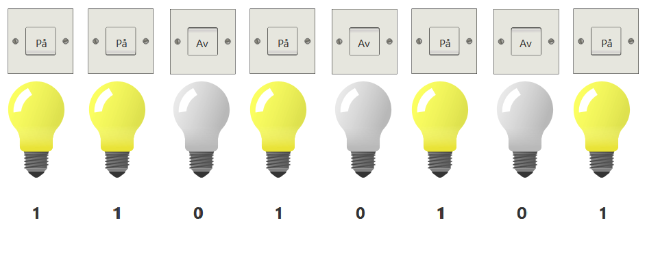

* Informasjon som strøm

Har du noen gang tenkt over hvordan en datamaskin egentlig fungerer? De fleste av oss ville nok vært svar skyldi dersom vi fikk et slikt spørsmål. Man kunne kanskje kunne resonnert seg til at elektronikk må være involvert, ettersom maskinene går på strøm. Noen har kanskje hørt at alt består av nullere og enere, uten å tenke så mye mer på hva det innebærer. La oss derfor starte der; i utviklingen av elektroniske datamaskiner fant man fort ut at den enkleste og billigste måten å lagre informasjon nettop var ved hjelp av to tilstander; "strøm av (0)" og "strøm på (1)".

Så hvordan kan vi lagre informasjon ved hjelp av dette? For å lettere illustrere la oss først se på et eksempel fra virkeligheten. Når den katolske kirke skal velge ny pave, låser kardinalene seg i en konklave der tradisjonen tilsier at de blir til de har blitt enige. Måten de signaliserer til omverdenen på er ved hjelp av røyken i pipa. Dersom det kommer svart røyk ut av pipa, har de enda ikke valgt og forsamlingen utenfor må vente et døgn til. Dersom det kommer hvit røyk ut av pipa, har de bestemt seg og jubelen kan slippes løs. Ved å se på svart røyk som tilstand 0, og hvit røyk som tilstand 1, kan vi altså overføre informasjon til omverdenen ved hjelp av disse.

Hva skjer da når vi øker antallet komponenter som kan ha strøm på eller av? Da øker også mengden av informasjon vi kan lagre. Med to komponenter har vi plutselig fire muligheter:

> 00
> 01
> 10
> 11

Hva skjer når vi øker til tre? 

Gå inn på https://bits-og-bytes.netlify.app/  

Sett antall lysbrytere til tre, og undersøk hvor mange mulige kombinasjoner du kan lage. Hva med fire? Nå begynner det kanskje å bli uoversiktlig, men det er et mønster her. For de som kan sin sannsynlighet, så vet vi at vi kan gange antaller muligheter per brytere med seg selv tilsvarende antall brytere vi har.

> 1 bryter:   2^1 = 2 muligheter
> 2 brytere:  2^2 = 4 muligheter
> 3 brytere:  2^3 = 8 muligheter
> ...
> 8 brytere:  2^8 = 256 muligheter

Slik kan vi fortsette. Vi ser fort at for hver nye "lysbryter" vi legger til så øker informasjonen vi kan lagre med det dobbelte. 

Dersom en av tilstandene vi kan lagre ser ut som følger:

Vil vi kunne skrive det om til følgende rekke: 1101 0101

Dette kaller vi for binære tall (binary digit), og vi kaller derfor hver "bryter" for en **bit**. For å kunne jobbe med binære tall må vi ha en viss forståelse av totallssystemet.

