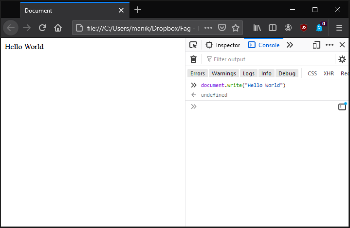
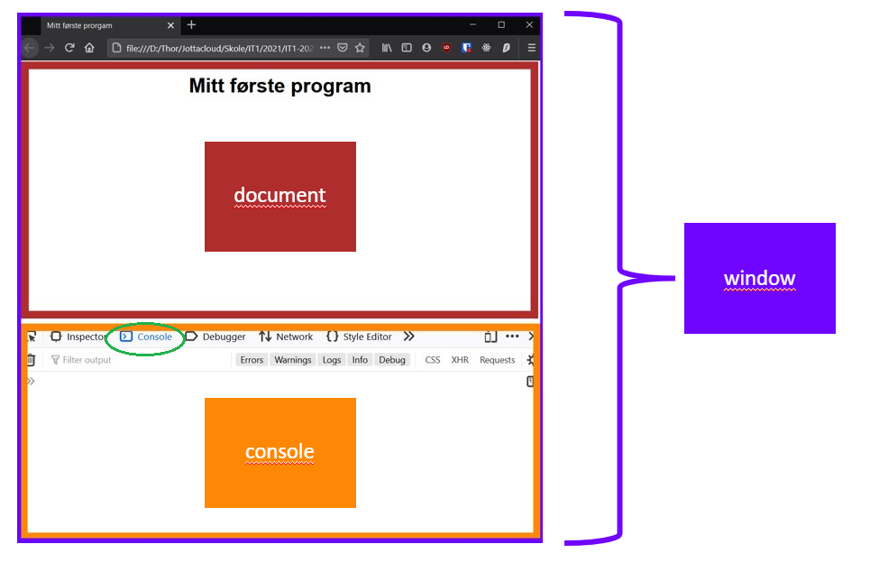
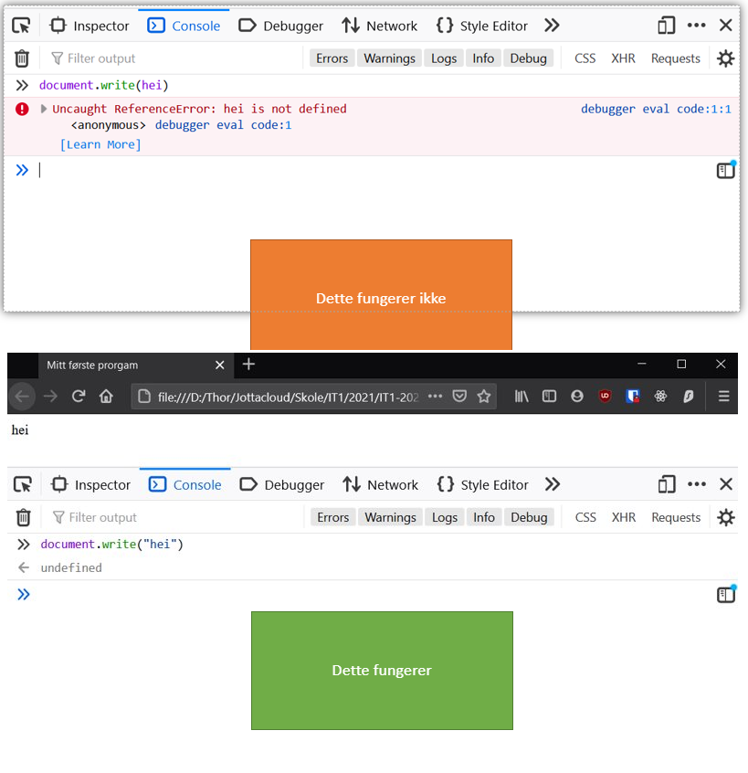

# INSTRUKSER

Vi har hittil jobbet med såkalte statiske nettsider. For at vi skal få mer interaksjon kan vi bruke javascript. Javascript er et av mange programmeringsspråk. Programmering handler i bunn og grunn om å gi datamaskinen instruksjoner som den kan gjennomføre. Vi vet at til slutt skal intruksjonene gjøres om til elektriske impulser (0 og 1), men den biten har andre løst for oss. Vi må derfor vite hvilke instrukser vi kan gi, og hvordan vi skriver de. Dette vil variere for forskjellige programmeringsspråk, men det er likevel en grunnleggende struktur som er ganske lik for de fleste språk. Det gjør at når man først har lært seg et språk, blir det lettere å lære andre.

Javascript er et språk med instrukser som kan kjøres rett fra nettleseren vår. La oss se litt på hvordan. Lag en ny html-side der du kun legger inn en overskrift, for eksempel

```HTML
<h1>Mitt første program</h1>
```

Åpne nettsiden og inspiser koden, i stedet for å inspisere html elementene slik du er vant til, så kan du se etter fanen som heter konsoll (eller console). Her kan vi skrive programmerings-instrukser som nettleseren kan tolke og gjennomføre. La oss prøve, vi skriver følgende: *document.write("Hello World")* og trykker enter. Vi ser at instruksen vår endret overskriften om til teksten på nettsiden vår. 



document.write("Hello Verden") er ikke en spesielt god instruks, og senere bør vi unngå å bruke den (vi vil jo ikke at eksisterende innhold fra nettsiden skal forsvinne), men den er et godt eksempel prinsippene bak javascript. Bildet nedenfor viser oss hva vi forholder oss til:



*document* er altså et kodenavn for selve nettsiden vår, vi utførte en funksjon som heter *write* på nettsiden. Den har andre laget for oss og er innebygd i javascript. Vi brukte punktum for å koble funksjonen til dokumentet. Inne i parentesen skrev vi beskjeden som skulle skrives. Alle funksjoner må ha en parentes, selv når ikke skal ha noe argument i parentesen. I tillegg måtte vi skrive teksten vår med anførselstegn. 

Dersom vi ikke følger reglene for hvordan instruksjonen nøyaktig skal skrives, så vil den ikke fungere, prøv for eksempel å ta vekk anførselstegnene og se hva som skjer:



Hvorfor er det slik? Selv om en datamaskin er ekstremt rask, så er den ikke særlig smart. Det betyr at vi må gi veldig presise instruksjoner. For eksempel må vi skille mellom tall og tekst. Tall kan man regne på, men ikke tekst. En maskin vet ikke forskjellen, så derfor legger vi all tekst i anførselstegn. Slike regler finnes det mange av, og det å sette seg inn i disse er en stor del av å lære seg programmering.

La oss starte med noen flere instrukser vi kan teste ut:


## PRØV SELV

Prøv selv instruksene i konsollen. Husk at beskjedene er tekst og må skrives med anførselstegn. Hva gjør hver av disse?

## SCRIPT-ELEMENTET

Du har kanskje merket deg at det er litt klønete og slitsomt å skrive koden rett inn i konsollen? Vi kan for eksempel ikke endre på koden som allerede er kjørt. Vanligvis skriver vi kode i egne filer, som vi kan kjøre når vi selv ønsker. For javascript kan vi velge mellom å skrive i et script element i html-fila, eller å lage en egen js-fil som vi kan koble til html:

```HTML
<body>
    <h1>Mitt første program</h1>
    
    <script>
        window.alert("Viktig beskjed!")
    </script>
    
</body>
```