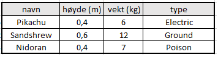
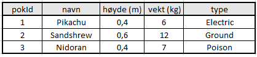
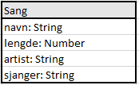
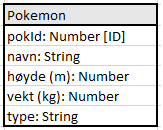
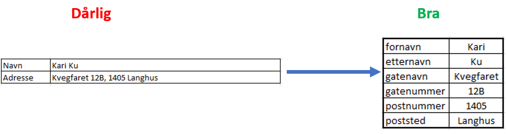

# Primærnøkkel

Anta at vi skal lage en nettside om pokemon, og ønsker å lagre disse i en database. Da bør vi først se for oss en tabell med informasjonen vi ønsker å lagre

Når vi lagrer datene må vi være sikre på at vi kan finne tilbake til det vi ønsker. Da må det være en av egenskapene som vi er *100% sikre på at er unik* for hvert objekt i databasen! Denne egenskapen kalles for en `primærnøkkel` og må være med. I modellen med pokemon, er det bare navnet som muligens kan være unikt. Vi kunne ha brukt navn som primærnøkkel, men bare hvis vi er sikre på at det aldri vil komme en pokemon i fremtiden som vil ha samme navn. Dersom vi er usikre på om noen av innføringene våre kan brukes som primærnøkler, kan vi alltids legge til ett nytt felt i modellen:

  
*pokId er en teller som øker for hver nye pokemon, garantert unik* 

> Alle objekter i en database må ha en primærnøkkel

Når vi skal lage en modell, vil innføringene som muligens kan brukes som primærnøkler kalles for `kandidatnøkler`.

#### Prøv selv - Liste over mine favorittsanger
Gitt følgende datamodell:

Argumenter for at ingen av innføringene er gode kandidatnøkler. Gi et forslag til primærnøkkel

# Datamodell

Dersom vi skal visualisere tabellen med pokemon, er det unødvendig å ha med eksempler på de forskjellige pokemonene, det holder med en oversikt over hva vi skal lagre for hvert objekt. I tillegg må vi angi hva som skal være primærnøkkel. Det er også vanlig å legge ved informasjon om hva slags datatype det er vi skal lagre. For vår del handler det stort sett om det det er tekst `String` (Streng på norsk) eller tall `Number`. Dersom du ønsker å regne på noe eller sortere det som tall, så kan det lagres som tall, og ellers går det fint med strenger. For eksempel kan et telefonnummer godt lagres som en streng, selv det består av tall. 

Tabellen med pokemon, kan dermed forenkles til følgende modell:

  
*Primærnøkkelen er markert med [ID]*

Denne modellen representerer tabellen med pokemon, den gir all informasjon vi trenger.

#### Prøv selv - Klasseliste

1. Anta at du skal lagre informasjon om de som går i klassen din. 
2. Hvordan vil datamodellen se ut? 
3. Hvilke kandidatnøkler har du? 
4. Hvilke av kandidatnøklene egner seg best som primærnøkkel?

# Atomærkravet
Når vi skal lagre data, kan det være lurt å dele opp informasjonen. Dersom man skal kunne søke både på fornavn og etternavn separat, bør disse stå i hver sin kolonne. `Atomærkravet` sier at 

> alle verdier i en database må deles opp så langt det lar seg gjøre uten at de mister sin mening.

Selv om det er lurt å ha atomærkravet i bakhånd når du skal lage en datamodell, bør du alltid bruke skjønn. Hva skal dataene brukes til? Hvem skal søke? Hva slags behov har man når man skal hente ut data? Det er ikke alltid man trenger å dele opp informasjonen.
