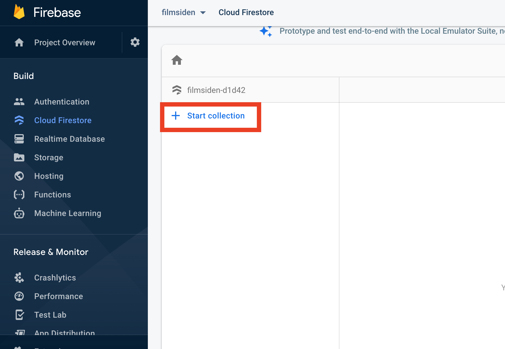
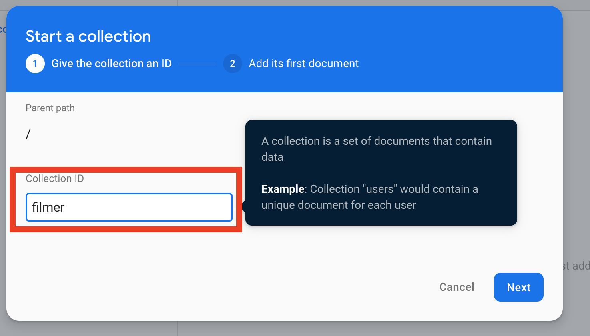
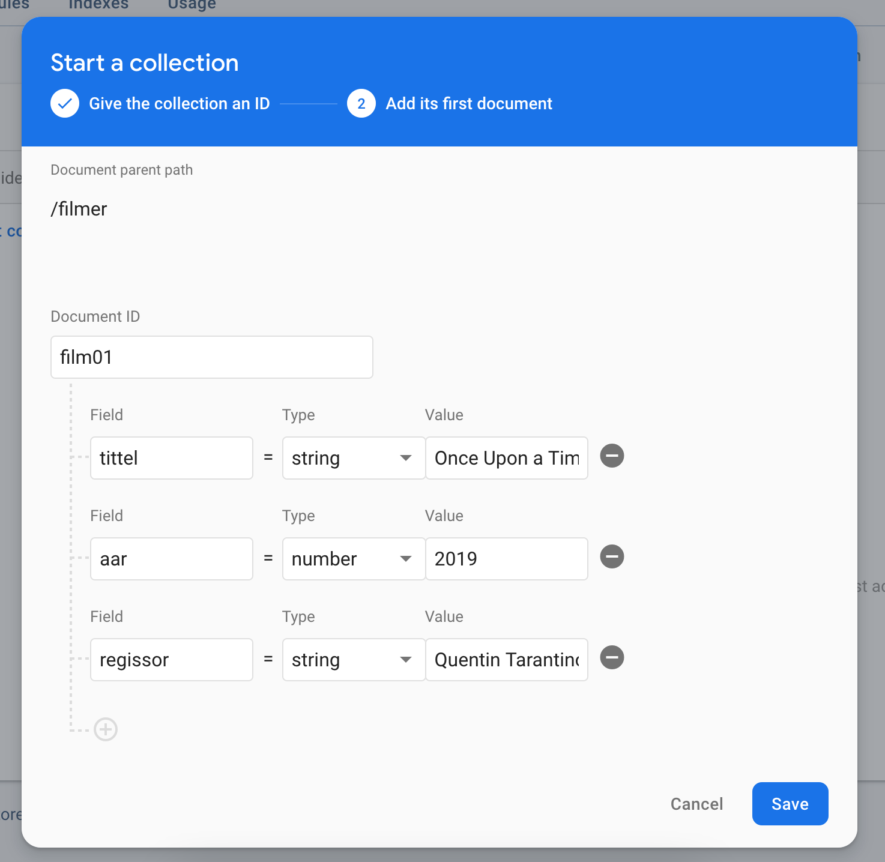

# Fylle databasen med data

1. Klikk på `Start collection` for å starte en kolleksjon

2. Gi kolleksjonen et navn, f.eks. filmer eller klaer

3. Legg til et dokument i databasen. Alle dokumentene må ha en unik `Document ID`.

4. Klikk på `Add document` for å legge til nye dokumenter i kolleksjonen.

> NB! Ikke bruk æ,ø,å i kolleksjonsnavn eller på egenskaper
