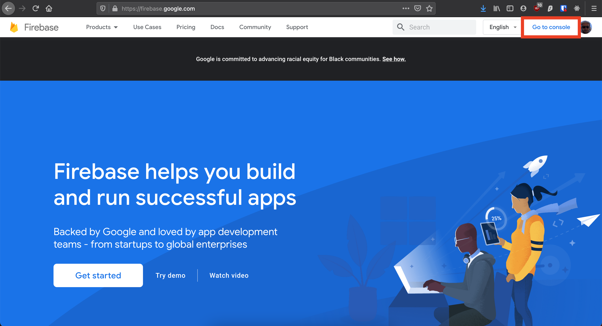
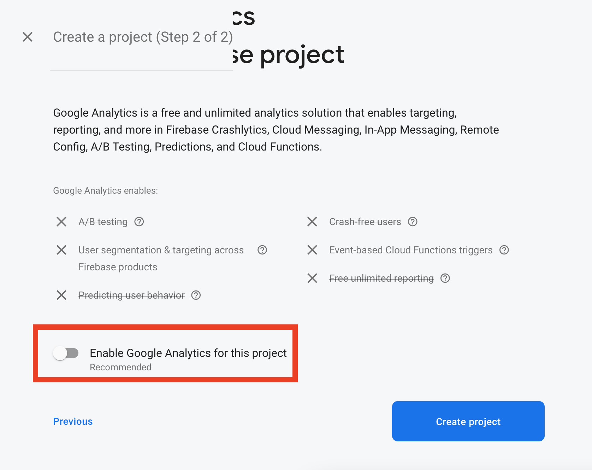
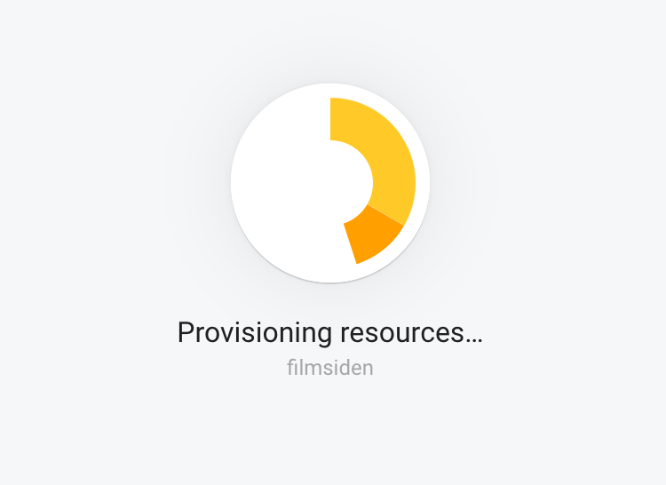
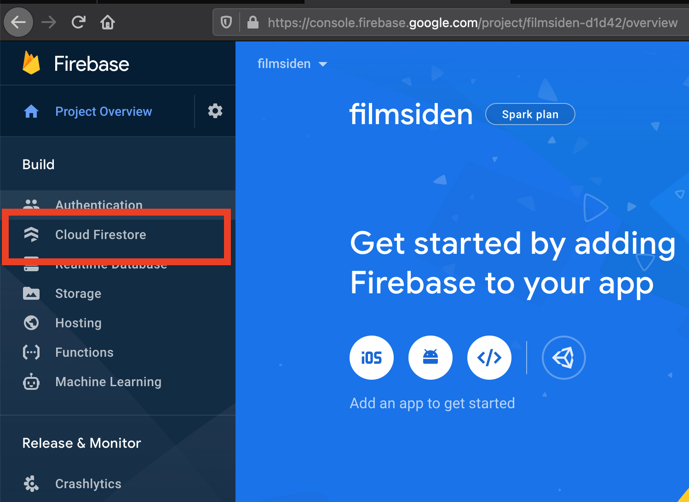
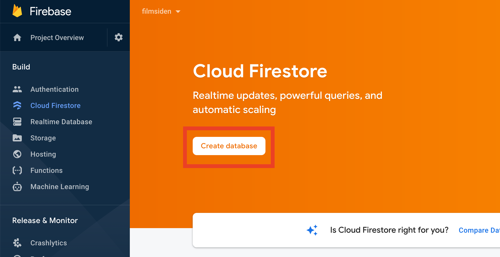
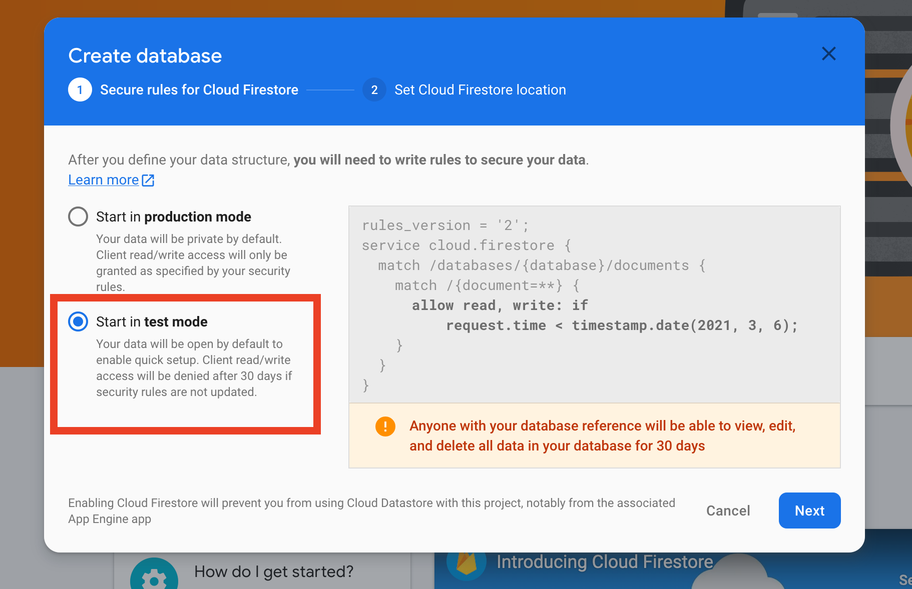
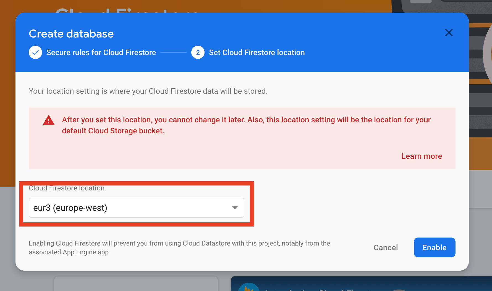
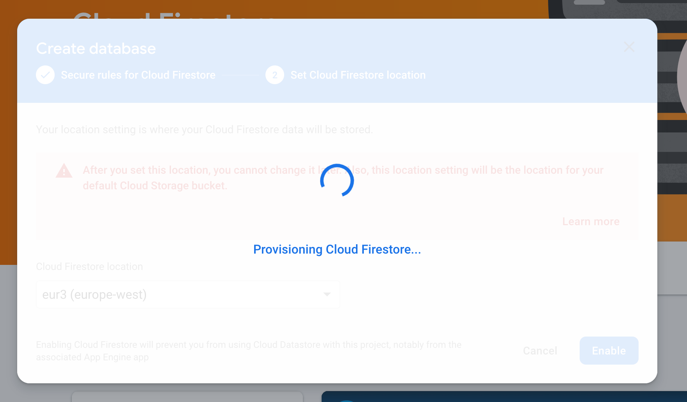
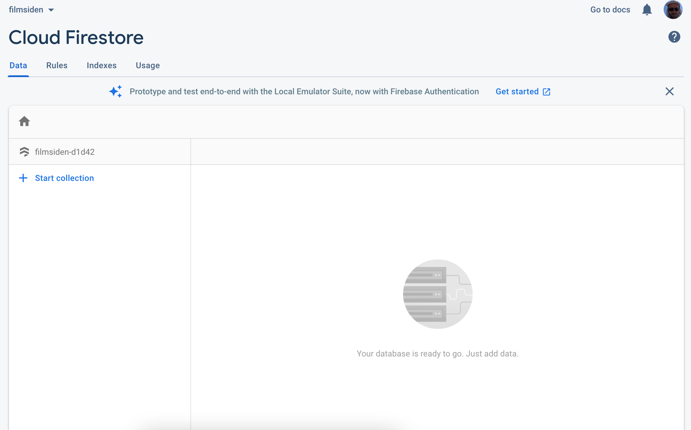

# Oppsett av Firebase Firestore

1. Gå inn på [firebase.google.com](https://firebase.google.com)  
2. Klikk på `Go to console`  

3. Klikk på `Add project`  

4. Gi et navn til prosjektet (databasen)  

5. Ta bort sending av data til Google  

6. Vent på at prosjektet ditt lages  

7. Klikk på `Cloud Firestore`  

8. Klikk på `Create database`  

9. Velg `Start in test mode`  

10. Velg `eur3 (europe-west)`  

11. Vent på at Firestore-databasen din opprettes  

12. Databasen er klar.  

