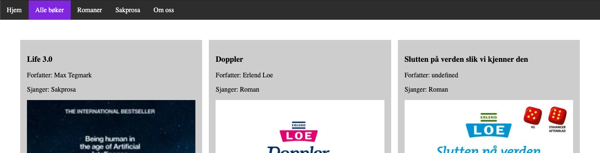

# Hente data fra databasen

## Hovedsiden - vise dyr fra databasen

Hovedsiden, **index.html**, skal vise en oversikt over dyrene i databasen.

### HTML

Vi lager en tom section som skal fylles med dyrene fra databasen.

```html
<section id="secDyr">
</section>
```

### Javascript

Referanser til html-elementet og databasen.

```js
const secDyr = document.querySelector("#secDyr");

const db = firebase.firestore();
const dyr = db.collection("dyr");
```

Funksjon for å hente ut alle dyr.

```js
const hentAlleDyr = async () => {
    secDyr.innerHTML = ``; // Sletter innholdet i secDyr.
    const svar = await dyr.get();
    for(const dyr of svar.docs){
        lagHTML(dyr.id, dyr.data());
    }
}

hentAlleDyr(); // Funksjonskall, gjør at funksjonen hentAlleDyr kjøres når siden lastes
```

Funksjon for å lage HTML-elementer for dyr.

```js
const lagHTML = (id, dyr) => {
    secDyr.innerHTML += `
        <div>
            <h3>${dyr.navn}</h3>
            <p>Type: ${dyr.type}</p>
            <p>Verdensdel: ${dyr.verdensdel}</p>
            
        </div>
    `;
}
```

## Eksempel: hente alle bøker

På undersiden alle-boker.html vises alle bøkene fra tabellen boker.



Denne linjen med kode henter alle bøkene fra tabellen boker:

```js
const svar = await boker.get(); // Henter alle bøker
```

Den settes inn i en funksjon som henter alle bøker og kjører funksjonen lagHTML på hver bok. Slik:

```js
// Spørringsfunksjoner
const hentAlleBoker = async () => {
  secBoker.innerHTML = ``; // Sletter innholdet i secBoker.
  const svar = await boker.get(); // Henter alle bøker
  for(const bok of svar.docs){
      lagHTML(bok.id, bok.data());
  }
}

// Funksjon som kjører når nettsiden lastes
hentAlleBoker();
```
