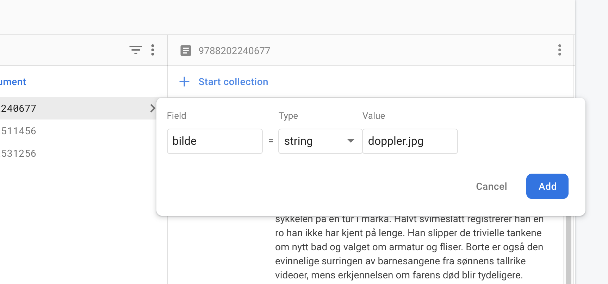
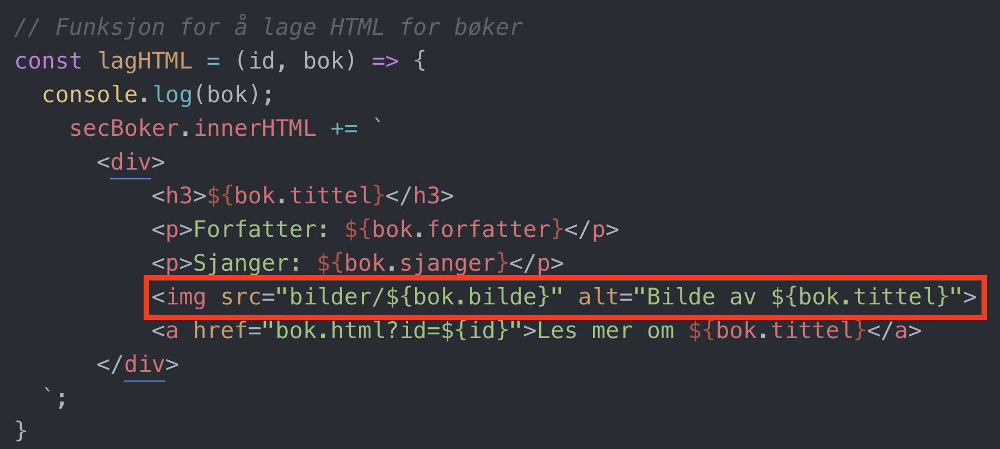

# Bilder i databasen

Bilder som skal brukes på nettstedet burde lagres lokalt sammen med html-filene til prosjektet. Legg gjerne bildene i en egen bildemappe, slik som på bildet nedenfor.

Når bildene ligger lagret på PCen må vi lagre filnavnet i databasen, slik som på bildet under.

Etter at filnavnet til bildet ligger i firestore kan vi hente det ut sammen med resten av dataen vi henter fra databasen.

Legg merke til "bilder/", dette er fordi bildene ligger i mappen bilder.
