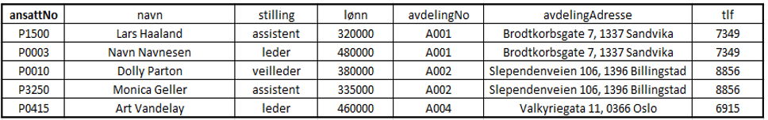
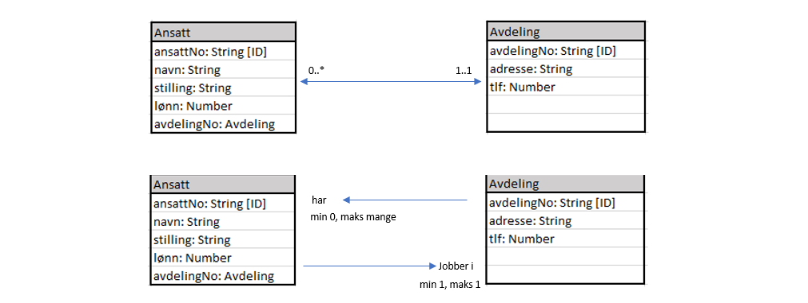
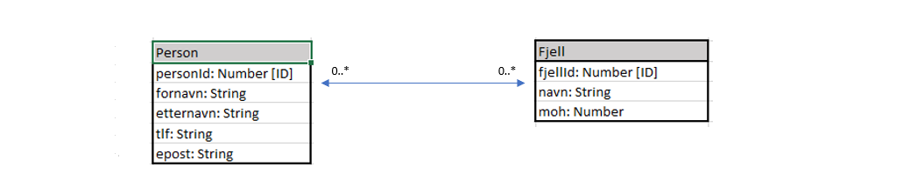
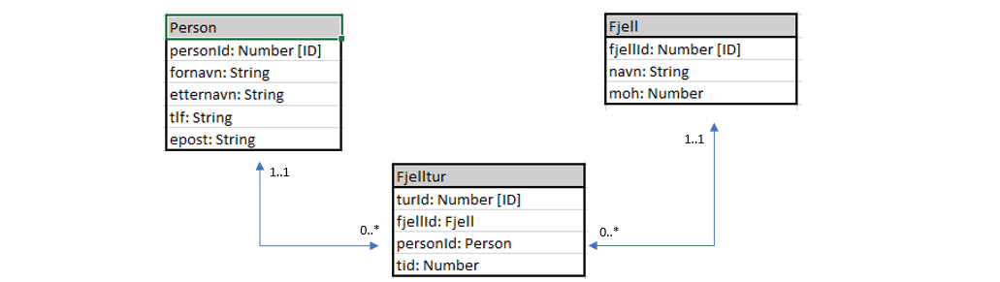

# Modellen utvides

Anta at du får i oppdrag til å lage en datamodell for en burgerkjede med flere filialer. Arbeidsgiver vil gjerne ha informasjon om de ansatte og hvilken avdeling de jobber på. De må også ha kontaktinformasjon til de ulike avdelingene. Dersom du ikke er stødig med IT-1 pensum, kan det være naturlig å foreslå en tabell som på figuren under. Denne tabellen er ikke spesielt god, og vi skal se nærmere på hvorfor.

Når modellen skal implementeres husker vi at vi skal kunne legge til nye data, endre eksisterende data og eventuelt slette data. La oss undersøke hvorfor denne tabellen vil kunne by på problemer for alle tre tilfellene:

* Legge til data: 
Dersom man skal legge til en nyansatt må man alltid føre på informasjon om avdelingen på nytt. Vi vil helst unngå å dobbeltlagre informasjon. Sjansen for at noen skriver feil øker for hver gang. Det vil skape problemer for en nyansatt, dersom vedkommende for eksempel ikke finnes i noen avdeling som følge av at noen tastet inn feil.

* Slette data: 
Se på det nederste objektet på figuren. Avdelingen til Art Vandelay er nyopprettet og det er kun han som er ansatt der. Dersom Art slutter, må vi slette objektet fra databasen. Problemet med er at da forsvinner hele avdelingen!

* Endre data: 
Se for deg at avdelingen på Billingstad har 20 ansatte. Dersom vi skal endre telefonnummer til avdelingen, må vi inn i alle 20 objektene for å endre det. Det medfører mye ekstraarbeid og øker sjansen for feil.

Det som er problematisk med modellen ser altså ut til å være at vi har koblet sammen informasjon om ansatte med informasjon om avdelingen. Løsningen må være å separere informasjonen i to forskjellige tabeller, for så på en eller annen måte å koble de sammen. Vi må lære oss å lage en **relasjonsmodell**

# Relasjonsmodeller

Når vi skiller informasjonen i to (eller flere) tabeller vil ofte disse være relatert til hverandre. I eksempelet hos burgerkjeden legger vi all informasjon om de ansatte i en tabell og all informasjon om avdelingen i en annen. Så legger vi inn primærnøkkelen til avdelingen inn i tabellen om de ansatte. Da vet vi i hvilken avdeling hver ansatt jobber. Vi har all informasjon tilgjengelig, uten at problemene beskrevet tidligere oppstår.

Modellen er fortsatt ikke optimal, det kan for eksempel hende at vi burde skille ut stillingskode og lønn i en egen tabell også, det ser vi på litt senere. I dette tilfellet er *avdelingNo* i tabellen for *Ansatt* viktig. Det er dette feltet som kobler tabellene sammen og det kalles for en `fremmednøkkel`. I vår modell indikerer vi at det er en fremmednøkkel ved å skrive navnet på tabellen det referes til som datatype. Kunne vi i stedet ha lagt *ansattNo* som fremmednøkkel i tabellen for avdeling? Det ville ikke ha fungert så bra, fordi en avdeling kan ha mange ansatte. I vår modell kan en avdeling ha mange ansatte, men en ansatt jobber kun i en avdeling. Vi har derfor en `en til mange` relasjon. Dersom vi legger til denne informasjonen i modellen vår har vi laget en `relasjonsmodell`. La oss se nærmere på de ulike typene relasjonene tabeller kan ha, og hvordan vi håndterer de i en relasjonsmodell.

#### En til mange 

En avdeling har mange ansatte, en ansatt jobber i en avdeling. Vi legger det til i modellen vår:

*Det øverste bildet viser hvordan vi skriver relasjonene, det nederste viser hvordan vi leser de*

Oppsummert så kan vi legge en fremmednøkkel i den tabellen som kun har en mulig innføring fra den andre.

#### Mange til mange

La oss se på et nytt eksempel. Vi skal lage en app der vi kan registrere fjellturer og ønsker en tabell med informasjon om brukerene, samt en annen tabell med informasjon om de ulike fjelltoppene. I dette tilfellet kan en bruker gå på flere fjelltopper, og et fjell kan ha flere personer som har gjennomført turen. Da blir det en **mange til mange** relasjon. 

Nå blir det blir vanskelig å sette fremmednøkkelen. Setter vi en personId som fremmednøkkel på tabellen for fjell, vil denne raskt fylles opp med alle personene som går turen. I motsatt tilfelle vil en fjellID hos person fylles opp, for hver ulike fjelltopp vedkommende registrerer. Vi kan dermed ikke sette fremmednøkkelen i noen av tabellen uten å bryte atomærkravet.

Vi løser dette problemet med å fjerne relasjonen mellom tabellene, og legge en ny tabell i mellom. Dette kalles for å `entitetisere` tabellene. I den nye tabellen legger vi inn fremmednøkkel fra hver av de to andre, samt en egen primærnøkkel. I vårt eksempel kan vi tenke oss at dersom *Person* og *Fjell* møtes, så har vi en fjelltur slik at det kan være vår nye tabell:

*Vi har ikke lenger mange til mange relasjoner. I vår nye entitetiserte tabell, kan vi legge til eventuell ny relevant informasjon*

Dersom det ikke er noe naturlig kobling mellom de to tabellene med en mange til mange relasjon, entitetiserer vi de likevel på samme måte. Da kaller vi gjerne den nye tabellen for en kombinasjon av de to gamle.

> Hva med `en til en` relasjoner? Har vi to tabeller med en slik relasjon kunne vi teoretisk ha satt fremmednøkkelen i hvilken som helst av de. I de tilfellene er det egentlig ikke noe vits i å skille informasjonen i to tabeller i første omgang. Dermed er det ikke vanlig å bruke slike relasjoner i en relasjonsmodell.

#### Prøv selv - Hva slags relasjoner?
kommer

#### Prøv selv - Entitetisering
kommer

#### Prøv selv - Hos veterinæren
kommer