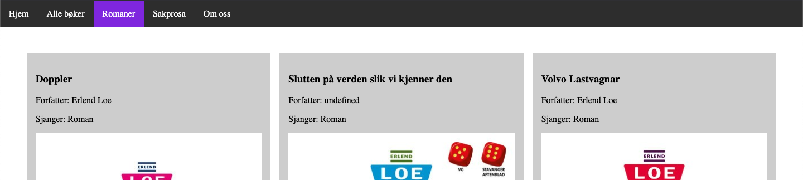

# Hente ut bare én type på underside

## Hente bare romaner

På undersiden **romaner.html** vises bare bøker fra tabellen **boker** som har type lik **Roman**.



Det er denne linjen med kode som henter bøker fra tabellen boker som har sjanger lik roman:

```js
const svar = await boker.where("type","==","Roman").get();
```

Under er hele funksjonen som henter romaner, og kjører lagHTML på bøkene. Legg merke til linje 4.

```js
// Spørringsfunksjoner
const hentAlleRomaner = async () => {
  secBoker.innerHTML = ``; // Sletter innholdet i secDyr.
  const svar = await boker.where("type","==","Roman").get();
  for(const bok of svar.docs){
      lagHTML(bok.id, bok.data());
  }
}

// Funksjon som kjører når nettsiden lastes
hentAlleRomaner();
```

## Større eller mindre enn

Det er også mulig å bruke større eller mindre enn. Det gjøres slik:

```js
const svar = await boker.where("pris", "<", 100).get();
```

```js
// Spørringsfunksjoner
const hentBilligBoker = async () => {
  secBoker.innerHTML = ``; // Sletter innholdet i secDyr.
  const svar = await boker.where("pris", "<", 100).get();
  for(const bok of svar.docs){
      lagHTML(bok.id, bok.data());
  }
}

// Funksjon som kjører når nettsiden lastes
hentBilligBoker();
```
