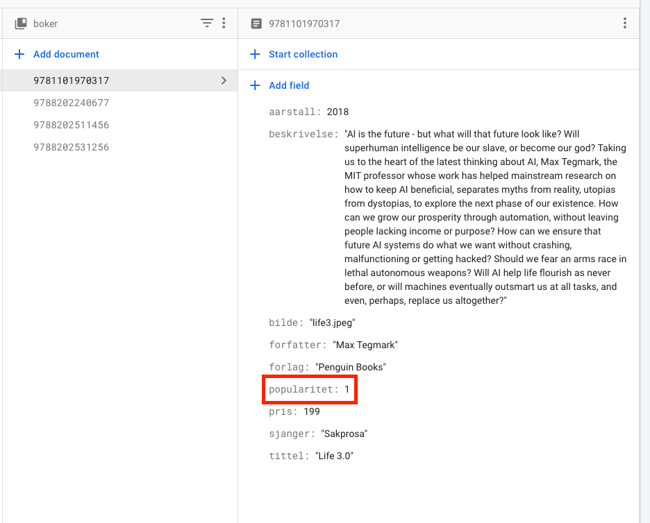

# Sortere med Select-element (dropdown)

## Sorter på pris


Lager et select-element med options som har values lik asc og desc. asc står for ascending, som betyr økende. Mens desc står for descending, som betyr synkende.

### HTML

```html
<select id="selSorter" onchange="hentAlleBoker()">
  <option value="asc">Pris lav til høy</option>
  <option value="desc">Pris høy til lav</option>
</select>
```

### Javascript

```js
const selSorter = document.querySelector("#selSorter");
```

```js
const hentAlleBoker = async () => {
        secBoker.innerHTML = ``; // Sletter innholdet i secDyr.
        const svar = await boker.orderBy("pris",selSorter.value).get();
        for(const bok of svar.docs){
            lagHTML(bok.id, bok.data());
        }
    }
```

> Legg merke til .orderBy("pris", selSorter.value) på linje 3

## Sorter på pris eller popularitet

### Firestore

I firestore må hvert dokument ha både pris og popularitet.



### HTML

Endrer på verdiene i options i HTML, nå kan vi selv velge hvilke verdier options'ene skal ha.

```html
<select id="selSorter" onchange="hentAlleBoker()">
  <option value="popularitet">Popularitet høy til lav</option>
  <option value="prisLav">Pris lav til høy</option>
  <option value="prisHoy">Pris høy til lav</option>
</select>
```

### Javascript

Nå skal vi ikke bare sortere på pris, da må vi legge til litt ekstra kode. En if-else-setning kan brukes.

```js
const hentAlleBoker = async () => {
  secBoker.innerHTML = ``; // Sletter innholdet i secDyr.
  let svar; // Oppretter en tom variabel for svar

  // if-else-setning som fyller variabelen svar med passende svar
  if(selSorter.value === "popularitet"){
    // Hvis verdien i selSorter er "popularitet" gjør følgende:
    svar = await boker.orderBy("popularitet").get();
  }
  else if (selSorter.value === "prisHoy") {
    // Hvis verdien i selSorter er "prisHoy" gjør følgende:
    svar = await boker.orderBy("pris","desc").get();
  }
  else if (selSorter.value === "prisLav") {
    // Hvis verdien i selSorter er "prisLav" gjør følgende:
    svar = await boker.orderBy("pris").get();
  }
  else{
    // Hvis veriden i selSorter er ingen av de over, gjør følgende:
    svar = await boker.get();
  }

  
  for(const bok of svar.docs){
      lagHTML(bok.id, bok.data());
  }
}
```

## Eksperttips 1: Filtrere dyr med select-meny

Med mange dyr i databasen kan det være nyttig å hente ut bare en spesiell type dyr, eller dyr fra en spesiell verdensdel.

### HTML

Vi lager et select-element, og fyller det med valg (options).

```html
<select name="velgType" id="selType">
    <option value="alle">Velg type dyr (alle typer)</option>
    <option value="Pattedyr">Pattedyr</option>
    <option value="Bløtdyr">Bløtdyr</option>
</select>
```

Pass på at verdien til **value** er helt lik som i databasen.

### Javascript

I javascript lager vi først en referanse til select-elementet.

```js
const selType = document.querySelector("#selType");
```

Deretter lager vi en funksjon som kjøres når select-elementet endres. Her legger vi på en **.where(“type”,”==”,seltype.value)**  i spørringen for kun å hente ut dyrene av den typen som er valgt i select-menyen.

```js
selType.onchange = async () => {
    const svar = await dyr.where("type","==",selType.value).get();
    secDyr.innerHTML = ``;
    for (const dyr of svar.docs) {
        lagHTML(dyr.id, dyr.data());
    }
}
```

Dette fungerer for **bløtdyr** og **pattedyr**, men ikke når vi velger alle igjen. For å fikse det må vi bruke en if-setning.

```js
selType.onchange = async () => {
    let svar; // Oppretter en "tom"-variabel
    
    if(selType.value === "alle"){ 
        // Hvis svar er lik "alle" gjør følgende:
        svar = await dyr.get();
    }
    else{
        // Ellers gjør følgende:
        svar = await dyr.where("type", "==", selType.value).get();
    }
    secDyr.innerHTML = ``;
    for (const dyr of svar.docs) {
        lagHTML(dyr.id, dyr.data());
    }
}
```
