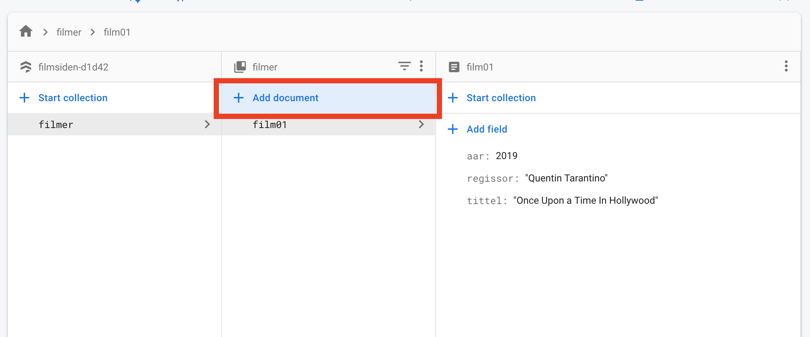
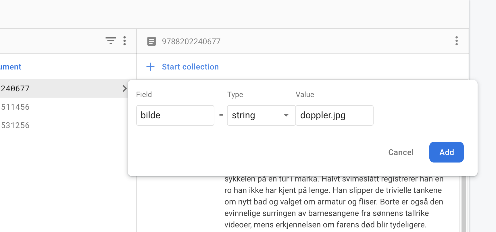
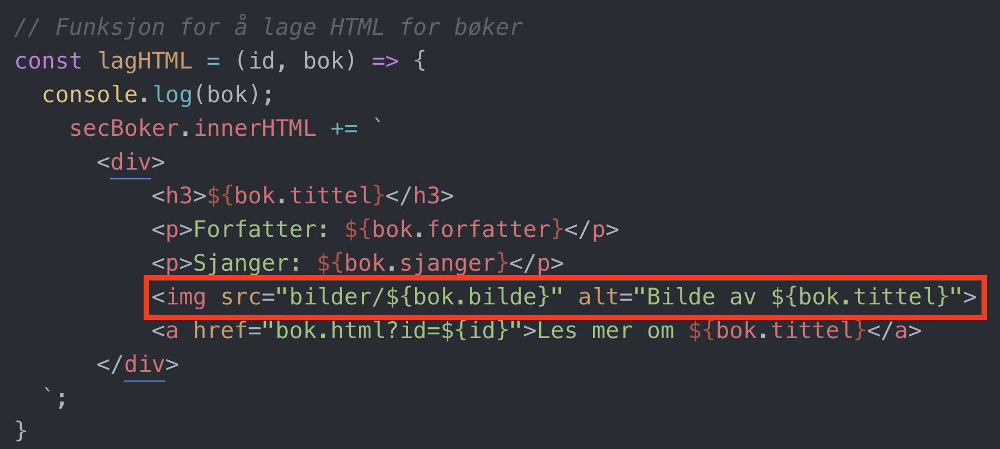
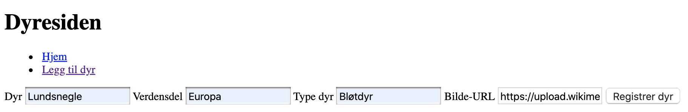

# 8.2 Legge til og endre data

## 8.2.1 Direkte i firebase firestore

1. Klikk på `Start collection` for å starte en kolleksjon.  

1. Gi kolleksjonen et navn, f.eks. filmer eller klaer.  

1. Legg til et dokument i databasen. Alle dokumentene må ha en unik `Document ID`.  

1. Klikk på `Add document` for å legge til nye dokumenter i kolleksjonen.  


> NB! Ikke bruk æ,ø,å i kolleksjonsnavn eller på egenskaper

## 8.2.2 Bilder

Bilder som skal brukes på nettstedet burde lagres lokalt sammen med html-filene til prosjektet. Legg gjerne bildene i en egen bildemappe, slik som på bildet nedenfor.


Når bildene ligger lagret på PCen må vi lagre filnavnet i databasen, slik som på bildet under.



Etter at filnavnet til bildet ligger i firestore kan vi hente det ut sammen med resten av dataen vi henter fra databasen.



Legg merke til "bilder/", dette er fordi bildene ligger i mappen bilder.

## 8.2.3 Eksperttips: Legge til data med javascript

### Registreringsside for dyr - registrere dyr i databasen

Registreringssiden, **registrer.html**, skal inneholde et skjema for å registrere dyr i databasen.

#### HTML

For å registrere dyr i databasen lager vi først et skjema (form-element) i html. Se kapittel 1.7 i læreboken (kode1) for å lære mer om hvordan du kan lage skjema (form-elementer).

```HTML
<form>
    <label for="inpDyr">Dyr</label>
    <input id="inpDyr" type="text" placeholder="Eks: Løve">

    <label for="inpVerdensdel">Verdensdel</label>
    <input id="inpVerdensdel" type="text" placeholder="Eks: Asia">

    <label for="inpType">Type dyr</label>
    <input id="inpType" type="text" placeholder="Eks: Pattedyr">

    <label for="inpBilde">Bilde-URL</label>
    <input id="inpBilde" type="text" placeholder="eks: https://eks.com/tiger.jpg">

    <button type="submit">Registrer dyr</button>
</form>
```

#### Javascript

Data fra skjemaet skal sendes til databasen, dette gjøres med javascript. Først lager vi referanser til html-elementer og til databasen.
Referanser til HTML-elementene.

```js
const inpDyr = document.querySelector("#inpDyr");
const inpVerdensdel = document.querySelector("#inpVerdensdel");
const inpType = document.querySelector("#inpType");
const inpBilde = document.querySelector("#inpBilde");
const form = document.querySelector("form");
```

Referanser til databasen og kolleksjonen **dyr**.

```js
const db = firebase.firestore();
const dyr = db.collection("dyr");
```

Til slutt må vi ha en funksjon som sender data til databasen når knappen trykkes på.

```js
form.onsubmit = (event) => {
    event.preventDefault(); // Hindrer nettleseren i å oppdatere siden når skjemaet sendes inn.
    dyr.add({ // Legger til et dyr i databasen
        navn: inpDyr.value,
        verdensdel: inpVerdensdel.value,
        type: inpType.value,
        bilde: inpBilde.value
    });
    form.reset();
}
```

#### Legge til dyr

Nå kan vi legge til noen dyr i databasen.



## 8.2.4 Eksperttips: Slette data med javascript

For å slette en oppføring fra databasen med javascript brukes **.delete()**.

```js
dyr.doc("dyr002").delete();
```
