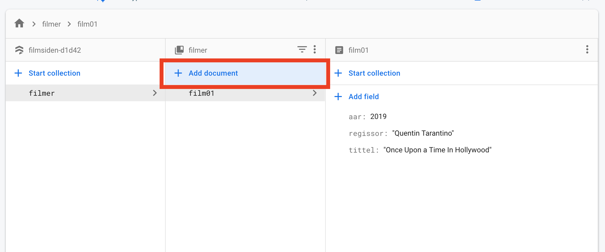

# Direkte i firebase firestore

1. Klikk på `Start collection` for å starte en kolleksjon.  

1. Gi kolleksjonen et navn, f.eks. filmer eller klaer.  

1. Legg til et dokument i databasen. Alle dokumentene må ha en unik `Document ID`.  

1. Klikk på `Add document` for å legge til nye dokumenter i kolleksjonen.  

> NB! Ikke bruk æ,ø,å i kolleksjonsnavn eller på egenskaper
