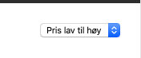
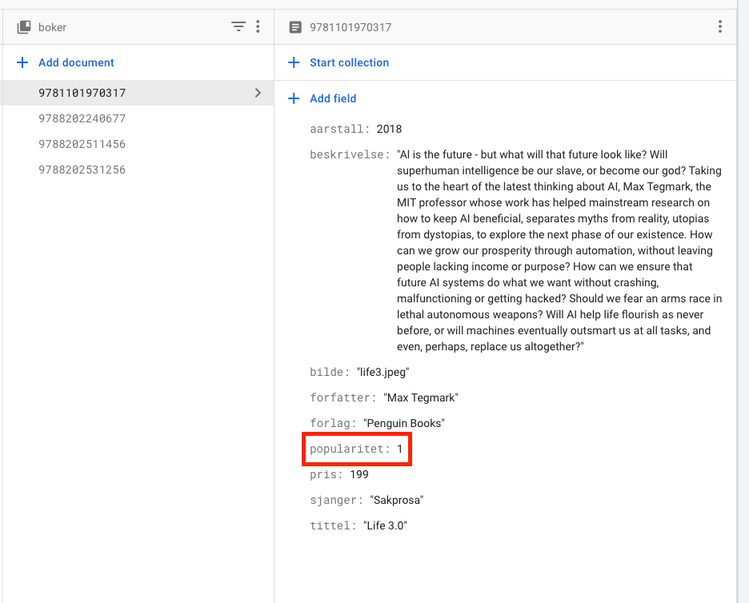
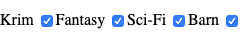
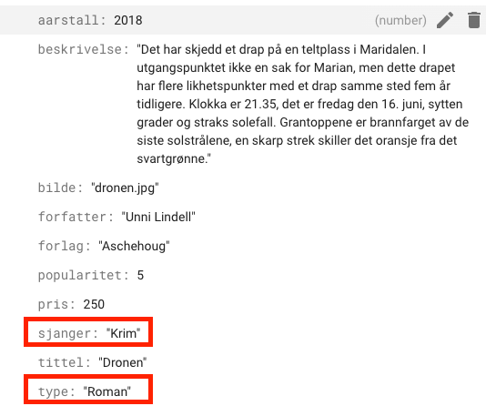
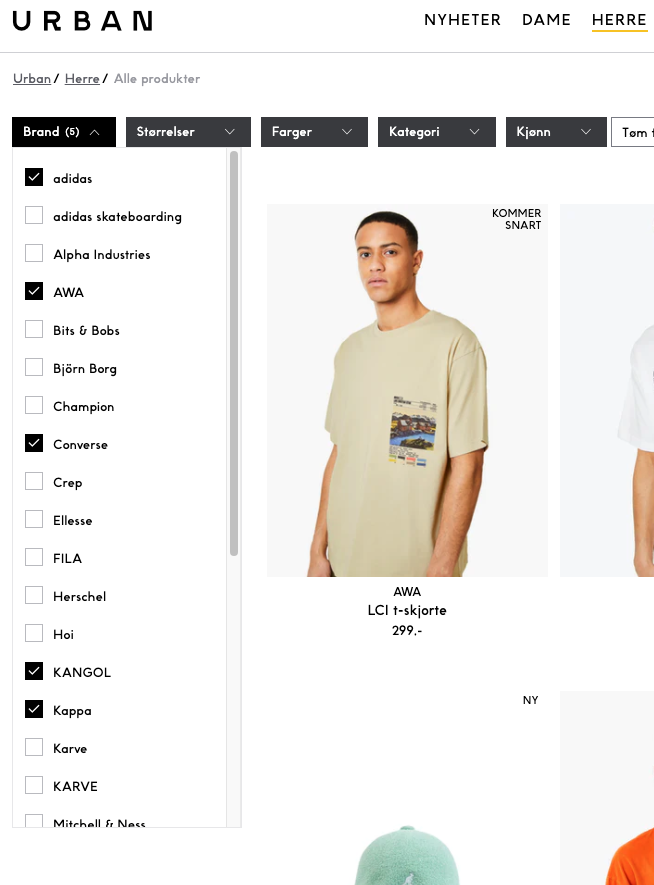
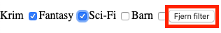
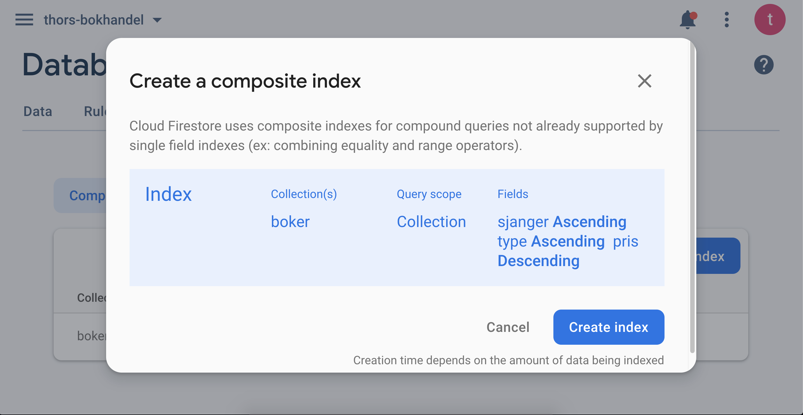

# 8.4 Sortere data

## 8.4.1 Hente ut bare én type på underside

### Hente bare romaner

På undersiden **romaner.html** vises bare bøker fra tabellen **boker** som har type lik **Roman**.


Det er denne linjen med kode som henter bøker fra tabellen boker som har sjanger lik roman:

```js
const svar = await boker.where("type","==","Roman").get();
```

Under er hele funksjonen som henter romaner, og kjører lagHTML på bøkene. Legg merke til linje 4.

```js
// Spørringsfunksjoner
const hentAlleRomaner = async () => {
  secBoker.innerHTML = ``; // Sletter innholdet i secDyr.
  const svar = await boker.where("type","==","Roman").get();
  for(const bok of svar.docs){
      lagHTML(bok.id, bok.data());
  }
}

// Funksjon som kjører når nettsiden lastes
hentAlleRomaner();
```

### Større eller mindre enn

Det er også mulig å bruke større eller mindre enn. Det gjøres slik:

```js
const svar = await boker.where("pris", "<", 100).get();
```

```js
// Spørringsfunksjoner
const hentBilligBoker = async () => {
  secBoker.innerHTML = ``; // Sletter innholdet i secDyr.
  const svar = await boker.where("pris", "<", 100).get();
  for(const bok of svar.docs){
      lagHTML(bok.id, bok.data());
  }
}

// Funksjon som kjører når nettsiden lastes
hentBilligBoker();
```

## 8.4.2 Sorter med knapper

Selv med en grovsortering i navigasjonsbaren kan det godt være at vi ønsker å sortere varene våre enda mer.

I dette avsnittet ser vi på hvordan dette kan gjøres ved hjelp av knapper.

Vi legger til en attributt kalt sjanger i firestore, og fyller denne med for eksempel: krim, fantasy, sci-fi og barn.

**For romanene som ikke oppfyller en av disse sjangerene, lar vi bare feltet stå tomt.**

### HTML

```html
<button id="alle" onclick="hentAlleBoker()">Alle Romaner</button>
<button id="krim" onclick="hentKrim()">Krim</button>
<button id="fantasy" onclick="hentFantasy()">Fantasy</button>
<button id="scifi" onclick="hentScifi()">Science Fiction</button>
<button id="barn" onclick="hentBarn()">For barn og unge</button>
```

Vi kaller på funksjoner som skal gjøre riktige spørringer når vi trykker på en knapp. Disse funksjonene må vi lage, men det blir veldig likt tidligere.

### Javascript

```js
const hentKrim = async () => {
    secBoker.innerHTML = ``; //Sletter gammelt innhold i secBoker.
    const svar = await boker.where("sjanger", "==","krim").get();
    for(const bok of svar.docs){
        lagHTML(bok.id, bok.data());
    }
}
```

Vi må lage de tre andre funksjonene også, men de lages på nøyaktig samme måte. Funksjonen hentAlleBoker har vi fra før av, så den trenger vi ikke lage på nytt.

### Alternativt - IT2-versjon

Det er også mulig å lage dette med bare en funksjon hentSjanger(sjanger), hvor vi sender inn sjangeren som parameter.

```html
<button id="alle" onclick="hentAlleBoker()">Alle Romaner</button>
<button id="krim" onclick="hentSjanger('Krim')">Krim</button>
<button id="fantasy" onclick="hentSjanger('Fantasy')">Fantasy</button>
<button id="scifi" onclick="hentSjanger('Sci-Fi')">Science Fiction</button>
<button id="barn" onclick="hentSjanger('Barn')">For barn og unge</button>
```

> Sjangeren som står mellom parentesene må være helt lik den i databasen.
>Legg merke til at det som sendes inn i funksjonen (mellom parentesene) skrives med 'enkle anførseltegn'. Dette er fordi sjangeren som sendes inn i funksjonen må være en string, og vi allerede er inne i en string definert med doble anførselstegn.

```js
const hentSjanger = async (sjanger) => {
    secBoker.innerHTML = ``; //Sletter gammelt innhold i secBoker.
    const svar = await boker.where("sjanger", "==",sjanger).get();
    for(const bok of svar.docs){
        lagHTML(bok.id, bok.data());
    }
}
```

## 8.4.3 Sortere med Select-element (dropdown)

### Sorter på pris



Lager et select-element med options som har values lik asc og desc. asc står for ascending, som betyr økende. Mens desc står for descending, som betyr synkende.

#### HTML

```html
<select id="selSorter" onchange="hentAlleBoker()">
  <option value="asc">Pris lav til høy</option>
  <option value="desc">Pris høy til lav</option>
</select>
```

#### Javascript

```js
const selSorter = document.querySelector("#selSorter");
```

```js
const hentAlleBoker = async () => {
        secBoker.innerHTML = ``; // Sletter innholdet i secDyr.
        const svar = await boker.orderBy("pris",selSorter.value).get();
        for(const bok of svar.docs){
            lagHTML(bok.id, bok.data());
        }
    }
```

> Legg merke til .orderBy("pris", selSorter.value) på linje 3

### Sorter på pris eller popularitet

#### Firestore

I firestore må hvert dokument ha både pris og popularitet.



#### HTML

Endrer på verdiene i options i HTML, nå kan vi selv velge hvilke verdier options'ene skal ha.

```html
<select id="selSorter" onchange="hentAlleBoker()">
  <option value="popularitet">Popularitet høy til lav</option>
  <option value="prisLav">Pris lav til høy</option>
  <option value="prisHoy">Pris høy til lav</option>
</select>
```

#### Javascript

Nå skal vi ikke bare sortere på pris, da må vi legge til litt ekstra kode. En if-else-setning kan brukes.

```js
const hentAlleBoker = async () => {
  secBoker.innerHTML = ``; // Sletter innholdet i secDyr.
  let svar; // Oppretter en tom variabel for svar

  // if-else-setning som fyller variabelen svar med passende svar
  if(selSorter.value === "popularitet"){
    // Hvis verdien i selSorter er "popularitet" gjør følgende:
    svar = await boker.orderBy("popularitet").get();
  }
  else if (selSorter.value === "prisHoy") {
    // Hvis verdien i selSorter er "prisHoy" gjør følgende:
    svar = await boker.orderBy("pris","desc").get();
  }
  else if (selSorter.value === "prisLav") {
    // Hvis verdien i selSorter er "prisLav" gjør følgende:
    svar = await boker.orderBy("pris").get();
  }
  else{
    // Hvis veriden i selSorter er ingen av de over, gjør følgende:
    svar = await boker.get();
  }

  
  for(const bok of svar.docs){
      lagHTML(bok.id, bok.data());
  }
}
```

### Eksperttips 1: Filtrere dyr med select-meny

Med mange dyr i databasen kan det være nyttig å hente ut bare en spesiell type dyr, eller dyr fra en spesiell verdensdel.

#### HTML

Vi lager et select-element, og fyller det med valg (options).

```html
<select name="velgType" id="selType">
    <option value="alle">Velg type dyr (alle typer)</option>
    <option value="Pattedyr">Pattedyr</option>
    <option value="Bløtdyr">Bløtdyr</option>
</select>
```

Pass på at verdien til **value** er helt lik som i databasen.

#### Javascript

I javascript lager vi først en referanse til select-elementet.

```js
const selType = document.querySelector("#selType");
```

Deretter lager vi en funksjon som kjøres når select-elementet endres. Her legger vi på en **.where(“type”,”==”,seltype.value)**  i spørringen for kun å hente ut dyrene av den typen som er valgt i select-menyen.

```js
selType.onchange = async () => {
    const svar = await dyr.where("type","==",selType.value).get();
    secDyr.innerHTML = ``;
    for (const dyr of svar.docs) {
        lagHTML(dyr.id, dyr.data());
    }
}
```

Dette fungerer for **bløtdyr** og **pattedyr**, men ikke når vi velger alle igjen. For å fikse det må vi bruke en if-setning.

```js
selType.onchange = async () => {
    let svar; // Oppretter en "tom"-variabel
    
    if(selType.value === "alle"){ 
        // Hvis svar er lik "alle" gjør følgende:
        svar = await dyr.get();
    }
    else{
        // Ellers gjør følgende:
        svar = await dyr.where("type", "==", selType.value).get();
    }
    secDyr.innerHTML = ``;
    for (const dyr of svar.docs) {
        lagHTML(dyr.id, dyr.data());
    }
}
```

## 8.4.4 Sorter med checkbox



Denne måten å sortere på er noe vanskeligere enn de andre, vi kan nemlig huke av en eller flere sjangere samtidig, og ønsker at nettsiden vår skal oppdatere seg automatisk og hente sjangerene vi har valgt.

Du bør ha god oversikt før du prøver denne fremgangsmåten.

### Firestore

Som i de andre eksemplene trenger vi en attributt for sjanger i firestore. Denne fyller vi med krim, fantasy, scifi og liknende. For romaner som ikke hører til noen av sjangrene lar vi feltet stå tomt.



### HTML

Vi lager et form-element, der vi legger inn alle checkboxene. Her trenger vi mange attributter som skal brukes senere i javascript koden. Det er viktig at verdien **value** er helt lik sjangeren i databasen.

```html
<form id="checkForm" onchange="hentMedCheck()">
  <div>
    <label for="krim">Krim</label>
    <input type="checkbox" value="Krim" name="krim" checked>
  </div>
  <div>
    <label for="fantasy">Fantasy</label>
    <input type="checkbox" value="Fantasy" name="fantasy" checked>
  </div>
  <div>
    <label for="sciFi">Sci-Fi</label>
    <input type="checkbox" value="Sci-Fi" name="sciFi" checked>
  </div>
  <div>
    <label for="barn">Barn</label>
    <input type="checkbox" value="Barn" name="barn" checked>
  </div>
</form>
```

### Javascript

Her blir det mye ny og ukjent kode:

```js
const hentMedCheck = async () => {
  secBoker.innerHTML = ``; // Sletter innholdet i secBoker
  
  const checkedBoxes = document.querySelectorAll("input[type=checkbox]:checked"); // Henter alle checkbokser som er checked, checkedBoxes blir en nodeList, som er ganske lik en array
  const checked = []; // Oppretter en tom array som skal fylles med checkbokser
  for(const box of checkedBoxes){ // For-løkke som går gjennom alle checkBoksene
    checked.push(box.value); // Legger verdien til checkboksene som er valgt i arrayen checked
  }
  
  const svar = await boker.where("type","==","Roman").where("sjanger","in", checked).get(); // Spør etter bøker hvor sjanger er i listen checked
  for(const bok of svar.docs){ // For-løkke som går gjennom alle bøkene i svaret
    lagHTML(bok.data()); // Lager html for hver bok
  }
}
```

Kort oppsummert så legger vi value-attributten til alle boksene som er valgt i en liste (som vi kaller checked). Så går vi gjennom listen med en for-løkke og henter tilhørende data med en spørring.

### Eksempel

Hentet fra Urban. Med litt CSS kan dette se ganske proft ut.



### Eksperttips 1: Vise alle hvis ingen er valgt

Ved å sjekke lengden på listen av valgte bokser, kan vi sjekke om ingen bokser er valgt. Hvis ingen bokser er valgt vil vi vise alle romaner (linje 5-7). Hvis lengden av listen over valgte bokser `checkedBoxes` er lik null, kan vi kalle opp funksjonen `hentRomaner()`; som henter alle romaner. Hvis ikke lengden er lik null kjører vi all koden som ligger i `else{}`(linje 8-17).

```js
const hentMedCheck = async () => {
  secBoker.innerHTML = ``; // Sletter innholdet i secBoker
  const checkedBoxes = document.querySelectorAll("input[type=checkbox]:checked"); // Henter alle checkbokser som er checked, checkedBoxes blir en nodeList, som er ganske lik en array

  if(checkedBoxes.length === 0){
    hentRomaner();
  }
  else{
    const checked = []; // Oppretter en tom array som skal fylles med checkbokser
    for(const box of checkedBoxes){ // For-løkke som går gjennom alle checkBoksene
      checked.push(box.value); // Legger verdien til checkboksene som er valgt i arrayen checked
    }

    const svar = await boker.where("type","==","Roman").where("sjanger","in", checked).get(); // Spør etter bøker hvor sjanger er i listen checked
    for(const bok of svar.docs){ // For-løkke som går gjennom alle bøkene i svaret
      lagHTML(bok.data()); // Lager html for hver bok
    }
  }
}
```

```js
const hentRomaner = async () => {
  const svar = await boker.where("type","==","Roman").get();
  for(const bok of svar.docs){
    lagHTML(bok.data());
  }
}
```

### Eksperttips 2: Knapp for å fjerne alle filter



#### HTML

```html
<button onclick="fjernFilter()">Fjern filter</button>
```

#### Javascript

```js
const fjernFilter = () => {
  const checkedBoxes = document.querySelectorAll("input[type=checkbox]:checked"); // Henter alle checkbokser som er checked, checkedBoxes blir en nodeList, som er ganske lik en array
  for(const box of checkedBoxes){
    box.checked = false;
  }
}
```

## 8.4.5 Avanserte spørringer

Mer utfyllende tekst kommer på denne siden etter hvert.

```js
const svar = await boker.where("type","==","Roman").where("sjanger","==", "Krim").orderBy("pris","desc").get();
```

Denne spørringen fungerer, men den gir en feilmelding. Trykk på linken i feilmeldingen for å lage en indeksering av databasen din.




## 8.4.6 Eksperttips - Åpne underside med sortering

### Hovedsiden

Hovedsiden inneholder en lenke til undersiden alle-boker.html, denne lenken har også med tilleggsinformasjonen **sjanger=krim**.

```html
<a href="alle-boker.html?sjanger=Krim">
    
</a>
```

### Alle-boker.html

På siden alle-boker.html kan vi hente ut informasjonen som ligger i URL-en.

```js
// henter type fra URL-adressen
const url = new URL(window.location.href);
const sjanger = url.searchParams.get("sjanger");
```

Denne typen kan vi nå bruke i funksjonen som henter bøker på denne siden.

```js
// funksjon som henter bøker fra databasen
const hentBoker = async () => {
  let svar; // Oppretter en tom variabel for svar
  
  if(type){ // hvis det finnes en type gjør følgende:
    svar = await boker.where("sjanger","==",sjanger).get();
  }
  else{ // ellers, altså hvis det ikke finnes en type, gjør følgende:
    svar = await boker.get();
  }
  
  console.log(svar);
  for(const bok of svar.docs){
    lagHTML(bok.id, bok.data());
  }
}

hentBoker(); // Kjører funksjonen hentAlle
```
