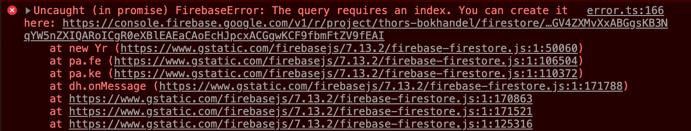

# Avanserte spørringer

Mer utfyllende tekst kommer på denne siden etter hvert.

```js
const svar = await boker.where("type","==","Roman").where("sjanger","==", "Krim").orderBy("pris","desc").get();
```

Denne spørringen fungerer, men den gir en feilmelding. Trykk på linken i feilmeldingen for å lage en indeksering av databasen din.




