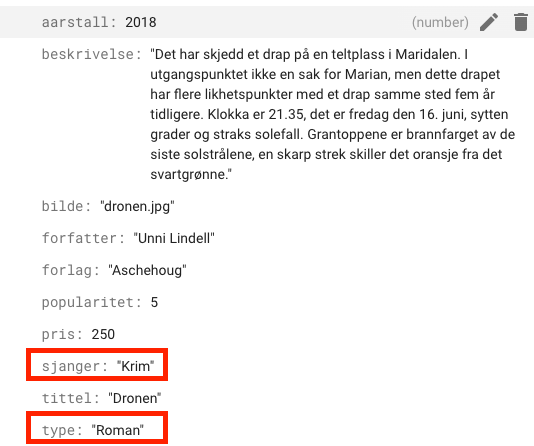

# Sorter med checkbox


Denne måten å sortere på er noe vanskeligere enn de andre, vi kan nemlig huke av en eller flere sjangere samtidig, og ønsker at nettsiden vår skal oppdatere seg automatisk og hente sjangerene vi har valgt.

Du bør ha god oversikt før du prøver denne fremgangsmåten.

## Firestore

Som i de andre eksemplene trenger vi en attributt for sjanger i firestore. Denne fyller vi med krim, fantasy, scifi og liknende. For romaner som ikke hører til noen av sjangrene lar vi feltet stå tomt.



## HTML

Vi lager et form-element, der vi legger inn alle checkboxene. Her trenger vi mange attributter som skal brukes senere i javascript koden. Det er viktig at verdien **value** er helt lik sjangeren i databasen.

```html
<form id="checkForm" onchange="hentMedCheck()">
  <div>
    <label for="krim">Krim</label>
    <input type="checkbox" value="Krim" name="krim" checked>
  </div>
  <div>
    <label for="fantasy">Fantasy</label>
    <input type="checkbox" value="Fantasy" name="fantasy" checked>
  </div>
  <div>
    <label for="sciFi">Sci-Fi</label>
    <input type="checkbox" value="Sci-Fi" name="sciFi" checked>
  </div>
  <div>
    <label for="barn">Barn</label>
    <input type="checkbox" value="Barn" name="barn" checked>
  </div>
</form>
```

## Javascript

Her blir det mye ny og ukjent kode:

```js
const hentMedCheck = async () => {
  secBoker.innerHTML = ``; // Sletter innholdet i secBoker
  
  const checkedBoxes = document.querySelectorAll("input[type=checkbox]:checked"); // Henter alle checkbokser som er checked, checkedBoxes blir en nodeList, som er ganske lik en array
  const checked = []; // Oppretter en tom array som skal fylles med checkbokser
  for(const box of checkedBoxes){ // For-løkke som går gjennom alle checkBoksene
    checked.push(box.value); // Legger verdien til checkboksene som er valgt i arrayen checked
  }
  
  const svar = await boker.where("type","==","Roman").where("sjanger","in", checked).get(); // Spør etter bøker hvor sjanger er i listen checked
  for(const bok of svar.docs){ // For-løkke som går gjennom alle bøkene i svaret
    lagHTML(bok.data()); // Lager html for hver bok
  }
}
```

Kort oppsummert så legger vi value-attributten til alle boksene som er valgt i en liste (som vi kaller checked). Så går vi gjennom listen med en for-løkke og henter tilhørende data med en spørring.

## Eksempel

Hentet fra Urban. Med litt CSS kan dette se ganske proft ut.


## Eksperttips 1: Vise alle hvis ingen er valgt

Ved å sjekke lengden på listen av valgte bokser, kan vi sjekke om ingen bokser er valgt. Hvis ingen bokser er valgt vil vi vise alle romaner (linje 5-7). Hvis lengden av listen over valgte bokser `checkedBoxes` er lik null, kan vi kalle opp funksjonen `hentRomaner()`; som henter alle romaner. Hvis ikke lengden er lik null kjører vi all koden som ligger i `else{}`(linje 8-17).

```js
const hentMedCheck = async () => {
  secBoker.innerHTML = ``; // Sletter innholdet i secBoker
  const checkedBoxes = document.querySelectorAll("input[type=checkbox]:checked"); // Henter alle checkbokser som er checked, checkedBoxes blir en nodeList, som er ganske lik en array

  if(checkedBoxes.length === 0){
    hentRomaner();
  }
  else{
    const checked = []; // Oppretter en tom array som skal fylles med checkbokser
    for(const box of checkedBoxes){ // For-løkke som går gjennom alle checkBoksene
      checked.push(box.value); // Legger verdien til checkboksene som er valgt i arrayen checked
    }

    const svar = await boker.where("type","==","Roman").where("sjanger","in", checked).get(); // Spør etter bøker hvor sjanger er i listen checked
    for(const bok of svar.docs){ // For-løkke som går gjennom alle bøkene i svaret
      lagHTML(bok.data()); // Lager html for hver bok
    }
  }
}
```

```js
const hentRomaner = async () => {
  const svar = await boker.where("type","==","Roman").get();
  for(const bok of svar.docs){
    lagHTML(bok.data());
  }
}
```

## Eksperttips 2: Knapp for å fjerne alle filter


### HTML

```html
<button onclick="fjernFilter()">Fjern filter</button>
```

### Javascript

```js
const fjernFilter = () => {
  const checkedBoxes = document.querySelectorAll("input[type=checkbox]:checked"); // Henter alle checkbokser som er checked, checkedBoxes blir en nodeList, som er ganske lik en array
  for(const box of checkedBoxes){
    box.checked = false;
  }
}
```
